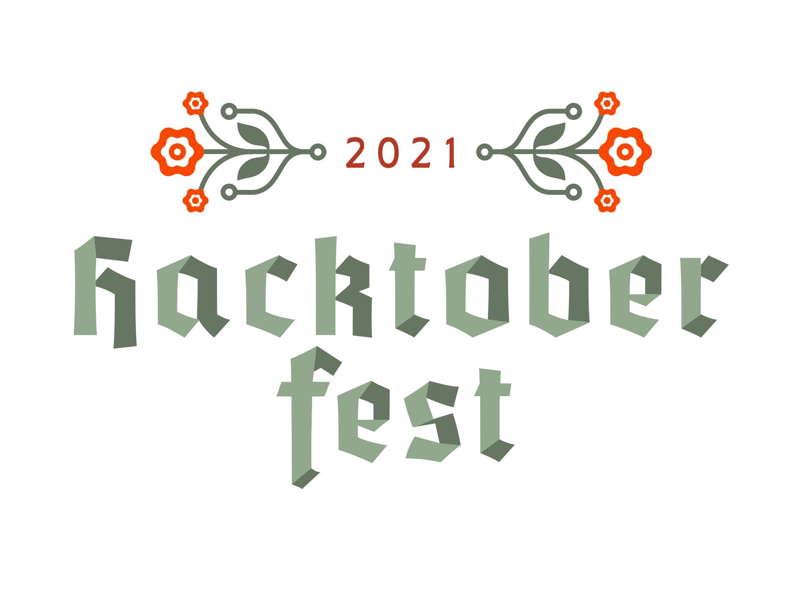

# Contributing

We'd love it if you could help make the Hacktoberfest Swag List even better. That's the spirit of open source after all!

By opening up a pull request to add a new company offering swag or to fix something, you'll also be banking towards earning your official Hacktoberfest t-shirt!

Check [Issues](https://github.com/crweiner/hacktoberfest-swag-list/issues) and current [Pull Requests](https://github.com/crweiner/hacktoberfest-swag-list/pulls) before contributing to avoid adding duplicates.

Please follow these rules regarding how to add a new company to the List:

## Rules of Contributing

If you wish to add something to the Hacktoberfest Swag List, that's great and we'd love to have you!

Please be sure to follow the simple rules:

1. Be sure you are looking to add something of substance to this project, not just spam PRs. PRs must meet the [Hacktoberfest Quality Standards](https://hacktoberfest.digitalocean.com/resources/qualitystandards)
2. Please be available to make changes within 48 hours when requested to do so. If you don't, then your PR may be closed.
3. Please fix all issues flagged by the bots, including CodeClimate, GH Actions, Netlify, CircleCI or any others as soon as possible, ideally right away.
4. A company must have publicly posted about their swag. You should include a link back to the original blog post, tweet, GitHub issue, etc. where the swag can be verified.
5. If adding a new company to the swag list, follow the formatting below:

## How to format your contribution

Make a [fork of this repo](https://github.com/crweiner/hacktoberfest-swag-list/fork) and add the details for what company and swag you find in the [Readme.md](./README.md).

We are using a very simple language called Markdown to format this list. It's basically a way to make things look pretty without having to use a rich text editor. Please familiarize yourself with Markdown [using this handy cheat sheet provided by GitHub](https://guides.github.com/pdfs/markdown-cheatsheet-online.pdf)

If you are adding a new company, be sure to add your company in two places:

### A to Z Order of Companies

Find the first letter of your company within the list, then add your information in the correct alphabetical order by using the following Markdown formatting:

```markdown
#### **Company Name**

- **Swag**: (T-shirt, stickers, etc)
- **Requirements**: What do I have to complete? Are there different requirements per swag item? Are the PRs merged or just submitted?
- **How to sign up**: Link to signup page using inline formatting of [text](URL)
- **Issues**: Optional link to Hacktoberfest tagged issues
- **Notes**: If needed, otherwise write "N/A". This is where links to blog posts/tweets go.
```

 If you don't see a letter heading for your company, please add it! Use the Markdown formatting to do so:

```markdown
### A
```

---

### Least Involvement to Most Involvement

Also add your company information to the correct section for this list. So far, the involvement scale is the following:

- Any - 1 PR
- 1 Merged PR
- 2 or more PRs
- 2 or more Merged PRs
- 5 Merged PRs
- Top Contributors

If your involvement requirements are completely different, feel free to create another level in the scale! Use the same Markdown formatting as a letter heading:

```markdown
### Another Involvement Level
```

Depending on your involvement requirements, place your company within the appropriate section.

This section of the list will follow a slightly different set of formatting in order to make the requirements more prominent:

```markdown
#### **Company Name** (swag earned at this level)

- **Requirements**: If the company only offers one type of swag, then state the requirements here
  - If they offer multiple levels of swag, then record this particular swag item here as an indented bullet point
- **Swag**: T-shirt, stickers, etc
- **How to sign up**: Link to signup page using inline formatting of [text](URL)
 **Issues**: Optional link to Hacktoberfest tagged issues
- **Notes**: If needed, otherwise write "N/A". This is where links to blog posts/tweets go
```

If you have multiple types of swag for different involvement levels, be sure to add two separate entries for each individual piece of swag earned! For example, Operation Code has two types of swag earned at different levels:

#### **Operation Code**

- **Requirements**:
  - Stickers and handwritten note: Simply get a pull request merged!
  - T-shirt: Resolve 3 issues.

For each piece of swag, a separate entry was added at the appropriate involvement levels:

_1. For the stickers and a handwritten note only (placed at 1 Merged PR level):_

```markdown
#### **Operation Code** (Stickers, handwritten note)

- **Requirements**:
  - Stickers and a handwritten note: Simply get a pull request merged!
- **Swag**: T-shirt, handwritten note, stickers
- **How to sign up**: We're tracking it manually and will comment you a Google form.
- **Notes**: See the pinned repositories [here](https://github.com/OperationCode). You can find out more information about our all-volunteer, non-profit organization and our social media accounts via [our website](https://operationcode.org/).
```

_2. For the T-Shirt only (placed at 2 or more Merged PRs level):_

```markdown
#### **Operation Code** (T-shirt)

- **Requirements**:
  - T-shirt: Resolve 3 issues.
- **Swag**: T-shirt, handwritten note, stickers
- **How to sign up**: We're tracking it manually and will comment you a Google form.
- **Notes**: See the pinned repositories [here](https://github.com/OperationCode). You can find out more information about our all-volunteer, non-profit organization and our social media accounts via [our website](https://operationcode.org/).
```

Note that the requirements have been edited for clarity, only showing the requirements for that type of swag and moved to the first bullet point. Also, the swag type is placed in parentheses after the company name to understand what is being earned at each level. 😊

---

## Support

This little project costs ~ $20/year to run between the domain name and Netlify costs. If you want to chip in a dollar for just the month of October, I'll be very grateful! You can Sponsor the project through [GitHub here](https://github.com/sponsors/crweiner). Thank you!

## Add your name

Did you help contribute to the Hacktoberfest Swag list? Add your name to the list of humans.

Contribution formatting will follow these guidelines in Markdown.

```markdown
- [Bob Smith](https://github.com/bobsmith)
```

If your contribution or PR is not formatted correctly, I'll let you know and give you a chance to fix it.

---

## 2021 Contributors

- [Chandler Weiner](https://github.com/crweiner/)
- [Benjamin Altpeter](https://github.com/baltpeter/)
- [Pranjal Mishra](https://github.com/Pranjalmishra30)
- [Ferdinand Boas](https://github.com/ferdi05/)
- [Christy Jacob](https://github.com/christyjacob4)
- [Mcvean Soans](https://github.com/McTechie)
- [Rohit Mathew](https://github.com/rohitjmathew)
- [Biplob Sutradhar](https://github.com/biplobsd)
- [Amy Egan](https://github.com/amyegan)
- [Sidharth Sethi](https://github.com/TechSpiritSS)
- [Mridul Birla](https://github.com/Mridulbirla13)
- [Anurag Yadav](https://github.com/AnuragYadav365)
- [Gaurav Gupta](https://github.com/gauravgupta45)
- [sai sumanth kumar](https://github.com/saisumanthkumar)
- [Ubaldo Pescatore](https://github.com/P3trur0)
- [Aniket Pawar](https://github.com/Aniket-508)
- [Misty Newton](https://github.com/mketters)
- [Ravi Prasanth](https://github.com/raviprasanthgit)
- [Shivam Balikondwar](https://github.com/Hyperion101010)
- [Rishabh Kumar](https://github.com/luharuka)

---

Disclaimer: This website is a fan and community made creation. It is not affiliated with [Hacktoberfest](https://hacktoberfest.digitalocean.com/) or any company offering swag.



---

If you're looking for the Swag List from 2018,  2019, or 2020 [click here](https://github.com/crweiner/hacktoberfest-swag-list/releases) for the GitHub releases, [click here](https://github.com/crweiner/hacktoberfest-swag-list/tags) for the tags, and see the [2018](https://github.com/crweiner/hacktoberfest-swag-list/tree/2018), [2019](https://github.com/crweiner/hacktoberfest-swag-list/tree/2019), and [2020](https://github.com/crweiner/hacktoberfest-swag-list/tree/2020) branches.
