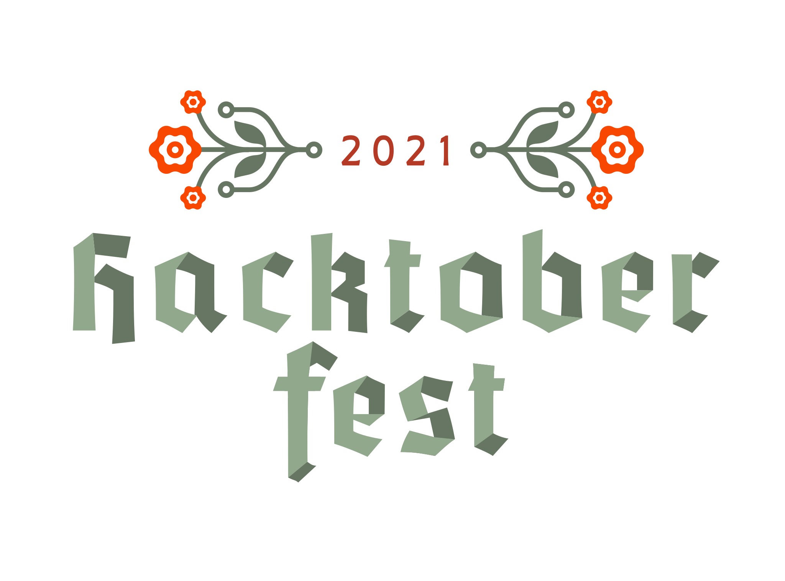

# Hacktoberfest 2021 Swag List

It's that time of year again! Time to get rewarded for contributing to the Open Source community! Did you know that there are multiple tech companies that participate in Hacktoberfest and give away sweet, sweet swag?

This repo seeks to document all of the companies giving away swag for Hacktoberfest 2021 and how you can get your hands on some free gifts for your time and help.

Right now, we're getting ready for Hacktoberfest 2021! Let's make this the best Hacktoberfest yet!

## Hacktoberfest is about making meaningful contributions to open source projects. SPAM for the sake of a T-shirt will not be tolerated

First, [sign up for Hacktoberfest 2021 by clicking this link](https://hacktoberfest.digitalocean.com/) Then, [read about how to participate in a meaningful way in the FAQ](https://hacktoberfest.digitalocean.com/faq).

See [**Contributing.md**](./CONTRIBUTING.md) to see how to format your pull request to add a company's swag to the List!

## Quick Jump To

- [A to Z Order of Companies](#a-to-z-order-of-companies)
- [Least Involvement to Most Involvement Needed for Swag](#least-involvement-to-most-involvement)

---

## Swag List 2021

### **The Original - DigitalOcean, Appwrite, Intel, and Deepsource**

- **Swag**: T-shirt, stickers
- **Requirements**: 4 pull requests in any eligible [repository](https://github.com/topics/hacktoberfest)
- **How to sign up**: [Hacktoberfest Website](https://hacktoberfest.digitalocean.com)
- **Notes**: For your PR to count it must be:
  - Submitted in a public repo, AND
    - The PR is labelled as ```hacktoberfest-accepted``` by a maintainer, OR
  - Submitted in a repo labelled ```hacktoberfest```, AND
    - Merged, OR
    - Approved

## A to Z Order of Companies

### A

#### **Appsmith**

- **Swag**: T-shirt, stickers, water-bottle, hoodie and a surprise box
- **Requirements**:
  - 1 Merged PR -  Appsmith Stickers
  - 2 Merged PRs - Appsmith Stickers, Water Bottle
  - 3 Merged PRs - Appsmith Stickers, Water Bottle, Appsmith T-Shirt
  - 4 Merged PRs - Appsmith Stickers, Water Bottle, Appsmith Hoodie
  - 4 Merged PRs + - Appsmith Surprise Box
- **How to sign up**: [Register here](https://bit.ly/appsmith-hacktoberfest-registration)
- **Issues**: [Hacktoberfest issues](https://github.com/appsmithorg/appsmith/issues?q=is%3Aopen+is%3Aissue+label%3A%22Good+First+Issue%22+bug)
- **Notes**: Documentation and content contribution is also accepted. More info available on their blog [here](https://hacktoberfest.appsmith.com/)

#### **Appwrite**

- **Swag**: Limited Edition T-shirts, Stickers & Coffee Mugs!
- **Requirements**: Contribute to [open hacktoberfest issues](https://hacktoberfest.appwrite.io/), Build a demo app, Write a blog post or Create a tutorial.
  - **At least 1** accepted pull request in any eligible repository under the [Appwrite](https://github.com/appwrite/) organization with the `hacktoberfest` topic.
  - Swag Tiers
    - **1 accepted PR**   - OG Appwrite Stickers
    - **2 accepted PRs**  - Limited Edition Sticker Pack + previous tier
    - **3 accepted PRs**  - Limited Edition Coffee Mug + previous tier
    - **4+ accepted PRs** - Limited Edition T-Shirt + previous tier
- **How to sign up**: Join our [Discord server](https://appwrite.io/discord) and checkout the `#hacktoberfest` channel.
- **Notes**:
  - For your PR to count it must be submitted to one of the eligible Appwrite repositories, AND
    - The PR is labelled as ```hacktoberfest-accepted``` by a maintainer, OR
    - The PR is approved by a maintainer OR
    - The PR is merged by a maintainer
  - A Blog post counts as **2 PRs**
  - A Demo app counts as **2 PRs ( or more based on complexity )**
  - A Tutorial counts as **2 PRs ( or more based on complexity )**
- **Issues**: List of [Hacktoberfest Issues](https://hacktoberfest.appwrite.io/)

#### **AutoDL**

- **Swag**: T-shirt, stickers, bonus swag
- **Requirements**: Submit valid Pull Requests to close Issues labelled `hacktoberfest` in [AutoDL respositories](https://github.com/Auto-DL/Auto-DL).
- **How to sign up**: Join AutoDL's [Slack](https://join.slack.com/t/autodl/shared_invite/zt-qagxiwub-ywRM_oBvvF~F7YNtlBqy_Q) Workspace and start contributing!
- **Issues**: Check out the Issues at [Auto-DL/Auto-DL](https://github.com/Auto-DL/Auto-DL/issues?q=is%3Aissue+is%3Aopen+label%3Ahacktoberfest)!
- **Notes**:
  - For more details, read [this blog](https://dev.to/mctechie/autodl-celebrates-hacktoberfest-2021-25da)!
  - Any Issues not addressed on GitHub may be discussed on AutoDL's Slack Workspace.
  - For details regarding upcoming events and talks, kindly fill this [Form](https://forms.gle/46bVCcRGrYbf3jQe9)!

### B

#### **Bridgecrew**

- **Swag**: T-shirt, stickers
- **Requirements**:
  - Contribute to any [eligible repo](https://github.com/bridgecrewio) during the month of October.
  - Swag Tiers
    - **1 accepted PR**   - super ghoul sticker pack
    - **2+ accepted PRs**  - wicked Bridgecrew t-shirt + previous tier
- **How to sign up**: Check out the [Bridgecrew website](https://bridgecrew.io/blog/happy-hacktoberfest-2021/) for more details.
- **Notes**:
  - Use this [form](https://bridgecrew.io/event/2021-hacktoberfest/) to claim swag.

### C

#### **CAMUNDA**

- **Swag**: T-shirt, stickers
- **Requirements**: 4 pull requests to any of the following repos: [bpmn.io](https://github.com/bpmn-io), [camunda-modeller](https://github.com/camunda/camunda-modeler) and the [Camunda community hub](https://github.com/camunda-community-hub)
- **How to sign up**: Check out the [Camunda website](https://camunda.com/hacktoberfest2021/) for more details
- **Notes**:
  - For your PR to count it must be:
    - Submitted in a Camunda repo, AND
    - The PR is labelled as ```hacktoberfest-accepted``` by a maintainer
  - Once your PR's are approved fill out the submission form [here](https://camunda.com/hacktoberfest2021/)

### D

#### **Datenanfragen.de e. V.**

- **Swag**: At least 3 stickers and a webcam cover. T-shirt for the top contributors.
- **Requirements**: 1 merged pull request in an [eligible repo](https://www.datarequests.org/blog/hacktoberfest-2021/#repos) to get at least 3 stickers and a webcam cover (limited to 100 sets). The 10 best contributions get a t-shirt in addition to that.
- **How to sign up**: Submit to the repositories either via PR on GitHub or via patch file by email and register using the [form](https://www.datarequests.org/blog/hacktoberfest-2021) before November 4, 2021.
- **Issues**: [datenanfragen](https://github.com/search?&q=user%3Adatenanfragen+type:issue&state=open&type=Issues)
- **Notes**: Read [the blog post](https://www.datarequests.org/blog/hacktoberfest-2021/) for more details. [Learn more](https://www.datarequests.org/verein) about their non-profit and their mission to help people exercise their right to privacy.

### E

#### **Earthly**

- **Swag**: Stickers (limit 40)
- **Requirements**: Contribute code to the [Earthly](https://github.com/earthly/earthly) open source build tool or contribute an Earthfile build to any public repo.
- **How to sign up**: [Grab an issue](https://github.com/earthly/earthly/issues?q=is%3Aissue+is%3Aopen+label%3Ahacktoberfest) and complete your PR after accepted please fill out this [form](https://forms.gle/DVkrWCu4yD2wMPmE8).
- **Notes**: If you need any assistance, [join their Slack channel](https://earthly.dev/slack). See their [Blog post](https://earthly.dev/blog/hacktoberfest-2021/) for more details.

### F

#### **Flyte**

- **Swag**: T-Shirts, Mugs, Vouchers, Limited Edition "The North Face®" Jackets!
- **Requirements**:
  - 2 merged/accepted PRs: Flyte Mug
  - 3 merged/accepted PRs or a video: Flyte T-Shirt
  - Full-fledged integration or a blog: Voucher or "The North Face®" Flyte Jacket
  - If your contribution adds value to Flyte heavily, they will customize your swag and add you as a Flyte contributor!
- **How to sign up**: Fill out [this](https://tally.so/r/3qPO7m) form after you are done with either of the challenges, on or before October 31st, 2021. Join Flyte's [Slack](https://docs.google.com/forms/d/e/1FAIpQLScWPJZncyL-bBCWbuQ9HWuMzA8-r2RJc__CSWJoAYUQADN-BQ/viewform) `#hacktoberfest2021` channel if you have any questions.
- **Issues**: [Hacktoberfest-tagged Flyte issues](https://github.com/flyteorg/flyte/issues?q=is%3Aissue+is%3Aopen+label%3AHacktoberfest+)
- **Notes**: Check out [their blog](https://blog.flyte.org/meet-flyte-at-hacktoberfest-2021) for more info. The first 15 contributors will get a mug irrespective of the number of merged pull requests.

### G

#### **Globo**

- **Swag**: T-shirt
- **Requirements**:
  - Contribute to two pull requests in any in any [eligible repo](https://hacktoberfest.globo.com/projetos/) during the month of October.
  - Ensure that at least one pull request is merged.
- **How to sign up**: Check out the [Globo website](https://hacktoberfest.globo.com/) for more details.
- **Notes**: Only the first 100 people residing in Brazil will receive the t-shirt.

### L

#### **LoginRadius**

- **Swag**: T-shirt
- **Requirements**: Submit a valid pull requests to any of [these issues](https://github.com/search?q=org%3ALoginRadius+label%3Ahacktoberfest+type%3Aissue) and have it accepted/merged.
- **How to sign up**: Fill [this form](https://forms.gle/qhG6Sf8qrBznRrtQA) after raising a pull request
- **Issues**: Check out the Issues [here](https://github.com/search?q=org%3ALoginRadius+label%3Ahacktoberfest+type%3Aissue)
- **Notes**: For more details, read [this blog](https://www.loginradius.com/blog/async/hacktoberfest-2021/)

### M

#### **Mattermost**

- **Swag**: Custom mechanical keyboard, Limited edition stickers
- **Requirements**:
  - 1+ contributions to the Mattermost community: Limited edition stickers
  - Top contributors: Custom mechanical keyboard
- **How to sign up**: Check out the [Mattermost website](https://mattermost.com/blog/hacktoberfest-2021/) for more details
- **Notes**: Check out the [Mattermost handbook for Hacktoberfest](https://handbook.mattermost.com/contributors/contributors/ways-to-contribute/hacktoberfest2021) and their [community colab server](https://docs.mattermost.com/guides/community-chat.html)

#### **MeiliSearch**

- **Swag**: reusable insulated water bottle, stickers
- **Requirements**: 4 or more pull requests in any eligible [repository](https://github.com/topics/hacktoberfest), including one pull request in MeiliSearch eligible [repositories](https://github.com/search?q=topic%3Ahacktoberfest+org%3Ameilisearch&type=Repositories)
- **How to sign up**: Check out [MeiliSearch blogpost](https://blog.meilisearch.com/contribute-hacktoberfest-2021/) for more details
- **Issues**: [Good first issues](https://github.com/search?q=meilisearch+label%3Ahacktoberfest+state%3Aopen+is%3Aissue&type=Issues)
- **Notes**: Check out [MeiliSearch blogpost](https://blog.meilisearch.com/contribute-hacktoberfest-2021/) for more details

## Least Involvement to Most Involvement

### Any - 1 PR

#### **Appwrite** (Stickers)

- **Requirements**: Contribute to [open hacktoberfest issues](https://hacktoberfest.appwrite.io/), Build a demo app, Write a blog post or Create a tutorial.
  - **At least 1** accepted pull request in any eligible repository under the [Appwrite](https://github.com/appwrite/) organization with the `hacktoberfest` topic.
  - Swag Tiers
    - **1 accepted PR**   - OG Appwrite Stickers
- **How to sign up**: Join our [Discord server](https://appwrite.io/discord) and checkout the `#hacktoberfest` channel.
- **Notes**:
  - For your PR to count it must be submitted to one of the eligible Appwrite repositories, AND
    - The PR is labelled as ```hacktoberfest-accepted``` by a maintainer, OR
    - The PR is approved by a maintainer OR
    - The PR is merged by a maintainer
  - A Blog post counts as **2 PRs**
  - A Demo app counts as **2 PRs ( or more based on complexity )**
  - A Tutorial counts as **2 PRs ( or more based on complexity )**
- **Issues**: List of [Hacktoberfest Issues](https://hacktoberfest.appwrite.io/)

#### **Bridgecrew** (Stickers)

- **Requirements**: Contribute to any [eligible repo](https://github.com/bridgecrewio) during the month of October.
- **Swag**: stickers
  - **1 PR**   - super ghoul sticker pack
- **How to sign up**: - Use this [form](https://bridgecrew.io/event/2021-hacktoberfest/) to claim swag.
- **Notes**: Check out the [Bridgecrew website](https://bridgecrew.io/blog/happy-hacktoberfest-2021/) for more details.

#### **LoginRadius** (T-shirt)

- **Requirements**: Submit a valid pull requests to any of [these issues](https://github.com/search?q=org%3ALoginRadius+label%3Ahacktoberfest+type%3Aissue) and have it accepted/merged.
- **Swag**: T-shirt
- **How to sign up**: Fill [this form](https://forms.gle/qhG6Sf8qrBznRrtQA) after raising a pull request
- **Issues**: Check out the Issues [here](https://github.com/search?q=org%3ALoginRadius+label%3Ahacktoberfest+type%3Aissue)
- **Notes**: For more details, read [this blog](https://www.loginradius.com/blog/async/hacktoberfest-2021/)

#### **Mattermost** (Stickers)

- **Requirements**: 1+ contributions to the Mattermost community
- **Swag**: Limited edition stickers
- **How to sign up**: Check out the [Mattermost website](https://mattermost.com/blog/hacktoberfest-2021/) for more details
- **Notes**: Check out the [Mattermost handbook for Hacktoberfest](https://handbook.mattermost.com/contributors/contributors/ways-to-contribute/hacktoberfest2021) and their [community colab server](https://docs.mattermost.com/guides/community-chat.html)

### 1 Merged PR

#### **Appsmith** (Stickers)

- **Requirements**: Create one or more merged pull requests on the [Appsmith Repo](https://github.com/appsmithorg/appsmith)
  - 1 merged PR: Stickers
- **Swag**: Stickers
- **How to sign up**: [Register here](https://bit.ly/appsmith-hacktoberfest-registration)
- **Issues**: [Hacktoberfest issues](https://github.com/appsmithorg/appsmith/issues?q=is%3Aopen+is%3Aissue+label%3A%22Good+First+Issue%22+bug)
- **Notes**: Documentation and content contribution is also accepted. More info available [here](https://hacktoberfest.appsmith.com/)

#### **Datenanfragen.de e. V.** (stickers, webcam cover)

- **Requirements**:
  - Eligible repositories include most repos of the datenanfragen organization. They are listed [here](https://www.datarequests.org/blog/hacktoberfest-2021/#repos).
  - 1 merged pull request to get at least 3 stickers and a webcam cover (limited to 100 sets).
- **Swag**: At least 3 stickers and a webcam cover; maybe a t-shirt (see below).
- **How to sign up**: Submit to the repositories either via PR on GitHub or via patch file by email and register using the [form](https://www.datarequests.org/blog/hacktoberfest-2021) before November 4, 2021.
- **Issues**: [datenanfragen](https://github.com/search?&q=user%3Adatenanfragen+type:issue&state=open&type=Issues)
- **Notes**: Read [the blog post](https://www.datarequests.org/blog/hacktoberfest-2021/) for more details. [Learn more](https://www.datarequests.org/verein) about their non-profit and their mission to help people exercise their right to privacy.

#### **Globo** (T-shirt, Brazil only)

- **Requirements**:
  - Contribute to two pull requests in any in any [eligible repo](https://hacktoberfest.globo.com/projetos/) during the month of October.
  - Ensure that at least one pull request is merged.
- **Swag**: T-shirt
- **How to sign up**: Check out the [Globo website](https://hacktoberfest.globo.com/) for more details.
- **Notes**: Only the first 100 people residing in Brazil will receive the t-shirt.

#### **Earthly** (Stickers)

- **Requirements**: Contribute code to the [Earthly](https://github.com/earthly/earthly) open source build tool or contribute an Earthfile build to any public repo.
- **Swag**: Stickers
- **How to sign up**: Complete your PR after accepted please fill out this [form](https://forms.gle/DVkrWCu4yD2wMPmE8). All PRs that are contributing value will get an Earthly sticker!
- **Issues**: [Grab an issue](https://github.com/earthly/earthly/issues?q=is%3Aissue+is%3Aopen+label%3Ahacktoberfest)
- **Notes**: If you need any assistance, [join their Slack channel](https://earthly.dev/slack). See their [Blog post](https://earthly.dev/blog/hacktoberfest-2021/) for more details.

### 2 or more PRs

#### **Appwrite** (Limited Edition T-shirts, Stickers & Coffee Mugs!)

- **Requirements**: Contribute to [open hacktoberfest issues](https://hacktoberfest.appwrite.io/), Build a demo app, Write a blog post or Create a tutorial.
  - **At least 1** accepted pull request in any eligible repository under the [Appwrite](https://github.com/appwrite/) organization with the `hacktoberfest` topic.
  - Swag Tiers
    - **1 accepted PR**   - OG Appwrite Stickers
    - **2 accepted PRs**  - Limited Edition Sticker Pack + previous tier
    - **3 accepted PRs**  - Limited Edition Coffee Mug + previous tier
    - **4+ accepted PRs** - Limited Edition T-Shirt + previous tier
- **How to sign up**: Join our [Discord server](https://appwrite.io/discord) and checkout the `#hacktoberfest` channel.
- **Notes**:
  - For your PR to count it must be submitted to one of the eligible Appwrite repositories, AND
    - The PR is labelled as ```hacktoberfest-accepted``` by a maintainer, OR
    - The PR is approved by a maintainer OR
    - The PR is merged by a maintainer
  - A Blog post counts as **2 PRs**
  - A Demo app counts as **2 PRs ( or more based on complexity )**
  - A Tutorial counts as **2 PRs ( or more based on complexity )**
- **Issues**: List of [Hacktoberfest Issues](https://hacktoberfest.appwrite.io/)

#### **Bridgecrew** (T-shirt, stickers)

- **Requirements**: Contribute to any [eligible repo](https://github.com/bridgecrewio) during the month of October.
- **Swag**
  - **2+ accepted PRs** - wicked Bridgecrew t-shirt + previous tier
- **How to sign up**: Use this [form](https://bridgecrew.io/event/2021-hacktoberfest/) to claim swag.
- **Notes**: Check out the [Bridgecrew website](https://bridgecrew.io/blog/happy-hacktoberfest-2021/) for more details.

#### **CAMUNDA** (T-shirt, stickers)

- **Requirements**: 4 pull requests to any of the following repos: [bpmn.io](https://github.com/bpmn-io), [camunda-modeller](https://github.com/camunda/camunda-modeler) and the [Camunda community hub](https://github.com/camunda-community-hub)
- **Swag**: T-shirt, stickers
- **How to sign up**: Check out the [Camunda website](https://camunda.com/hacktoberfest2021/) for more details
- **Notes**:
  - For your PR to count it must be:
    - Submitted in a Camunda repo, AND
    - The PR is labelled as ```hacktoberfest-accepted``` by a maintainer
  - Once your PR's are approved fill out the submission form [here](https://camunda.com/hacktoberfest2021/)

### The Original - **DigitalOcean, Appwrite, Intel, and Deepsource** (T-shirt, stickers)

- **Requirements**: 4 pull requests in any eligible [repository](https://github.com/topics/hacktoberfest)
- **Swag**: T-shirt, stickers
- **How to sign up**: [Hacktoberfest Website](https://hacktoberfest.digitalocean.com)
- **Notes**: For your PR to count it must be:
  - Submitted in a public repo, AND
    - The PR is labelled as ```hacktoberfest-accepted``` by a maintainer, OR
  - Submitted in a repo labelled ```hacktoberfest```, AND
    - Merged, OR
    - Approved

### 2 or more Merged PRs

#### **Appsmith** (Stickers, Water Bottle, T-Shirt)

- **Requirements**: Create two or more merged pull requests on the [Appsmith Repo](https://github.com/appsmithorg/appsmith)
  - 2+ merged PR: Stickers, Water Bottle, T-Shirt
- **Swag**: Appsmith Stickers, Water Bottle, Appsmith T-Shirt
- **How to sign up**: [Register here](https://bit.ly/appsmith-hacktoberfest-registration)
- **Issues**: [Hacktoberfest issues](https://github.com/appsmithorg/appsmith/issues?q=is%3Aopen+is%3Aissue+label%3A%22Good+First+Issue%22+bug)
- **Notes**: Documentation and content contribution is also accepted. More info available [here](https://hacktoberfest.appsmith.com/)

#### **Flyte** (Mugs, T-Shirts, Vouchers)

- **Requirements**:
  - 2 merged/accepted PRs: Flyte Mug
  - 3+ merged/accepted PRs or a blog/video: Flyte T-Shirt
  - Full-fledged flytekit integration or a blog: Voucher or The North Face® jacket
- **How to sign up**: Fill out [this](https://tally.so/r/3qPO7m) form after you are done with either of the challenges, on or before October 31st, 2021. Join Flyte's [Slack](https://docs.google.com/forms/d/e/1FAIpQLScWPJZncyL-bBCWbuQ9HWuMzA8-r2RJc__CSWJoAYUQADN-BQ/viewform) `#hacktoberfest2021` channel if you have any questions.
- **Issues**: [Hacktoberfest-tagged Flyte issues](https://github.com/flyteorg/flyte/issues?q=is%3Aissue+is%3Aopen+label%3AHacktoberfest+)
- **Notes**: Check out [their blog](https://blog.flyte.org/meet-flyte-at-hacktoberfest-2021) for more info.

#### **MeiliSearch** (water bottle, stickers)

- **Requirements**: 4 or more pull requests in any eligible [repository](https://github.com/topics/hacktoberfest), including one pull request in MeiliSearch eligible [repositories](https://github.com/search?q=topic%3Ahacktoberfest+org%3Ameilisearch&type=Repositories)
- **Swag**: reusable insulated water bottle, stickers
- **How to sign up**: Check out [MeiliSearch blogpost](https://blog.meilisearch.com/contribute-hacktoberfest-2021/) for more details
- **Issues**: [Good first issues](https://github.com/search?q=meilisearch+label%3Ahacktoberfest+state%3Aopen+is%3Aissue&type=Issues)
- **Notes**: Check out [MeiliSearch blogpost](https://blog.meilisearch.com/contribute-hacktoberfest-2021/) for more details

### 5 or more Merged PRs

#### **Appsmith** (Surprise Box)

- **Requirements**: Create five or more merged pull requests on the [Appsmith Repo](https://github.com/appsmithorg/appsmith)
  - 5+ merged PR: Surprise Box
- **Swag**: Surprise Box
- **How to sign up**: [Register here](https://bit.ly/appsmith-hacktoberfest-registration)
- **Issues**: [Hacktoberfest issues](https://github.com/appsmithorg/appsmith/issues?q=is%3Aopen+is%3Aissue+label%3A%22Good+First+Issue%22+bug)
- **Notes**: Documentation and content contribution is also accepted. More info available [here](https://hacktoberfest.appsmith.com/)

### Top Contributors

#### **AutoDL** (T-shirt, stickers, bonus swag)

- **Requirements**: Submit valid Pull Requests to close Issues labelled `hacktoberfest` in [AutoDL respositories](https://github.com/Auto-DL/Auto-DL).
- **Swag**: T-shirt, stickers, bonus swag
- **How to sign up**: Join AutoDL's [Slack](https://join.slack.com/t/autodl/shared_invite/zt-qagxiwub-ywRM_oBvvF~F7YNtlBqy_Q) Workspace and start contributing!
- **Issues**: Check out the Issues at [Auto-DL/Auto-DL](https://github.com/Auto-DL/Auto-DL/issues?q=is%3Aissue+is%3Aopen+label%3Ahacktoberfest)!
- **Notes**:
  - For more details, read [this blog](https://dev.to/mctechie/autodl-celebrates-hacktoberfest-2021-25da)!
  - Any Issues not addressed on GitHub may be discussed on AutoDL's Slack Workspace.
  - For details regarding upcoming events and talks, kindly fill this [Form](https://forms.gle/46bVCcRGrYbf3jQe9)!

#### **Datenanfragen.de e. V.** (T-shirt)

- **Requirements**:
  - Eligible repositories include most repos of the datenanfragen organization. They are listed [here](https://www.datarequests.org/blog/hacktoberfest-2021/#repos).
  - T-shirts are given out for the 10 best contributions as chosen by the maintainers.
- **Swag**: At least 3 stickers and a webcam cover (see above);  T-shirt for top contributors.
- **How to sign up**: Submit to the repositories either via PR on GitHub or via patch file by email and register using the [form](https://www.datarequests.org/blog/hacktoberfest-2021) before November 4, 2021.
- **Issues**: [datenanfragen](https://github.com/search?&q=user%3Adatenanfragen+type:issue&state=open&type=Issues)
- **Notes**: Read [the blog post](https://www.datarequests.org/blog/hacktoberfest-2021/) for more details. [Learn more](https://www.datarequests.org/verein) about their non-profit and their mission to help people exercise their right to privacy.

#### **Mattermost** (Custom mechanical keyboard)

- **Requirements**: Top contributors will receive a custom mechanical keyboard.
- **Swag**: Custom mechanical keyboard
- **How to sign up**: Check out the [Mattermost website](https://mattermost.com/blog/hacktoberfest-2021/) for more details
- **Notes**: Check out the [Mattermost handbook for Hacktoberfest](https://handbook.mattermost.com/contributors/contributors/ways-to-contribute/hacktoberfest2021) and their [community colab server](https://docs.mattermost.com/guides/community-chat.html)

---

*Disclaimer*: This website is a fan and community made creation. It is not affiliated with [Hacktoberfest](https://hacktoberfest.digitalocean.com/) or any company offering swag.



---

If you're looking for the Swag List from 2018,  2019, or 2020 [click here](https://github.com/crweiner/hacktoberfest-swag-list/releases) for the GitHub releases, [click here](https://github.com/crweiner/hacktoberfest-swag-list/tags) for the tags, and see the [2018](https://github.com/crweiner/hacktoberfest-swag-list/tree/2018), [2019](https://github.com/crweiner/hacktoberfest-swag-list/tree/2019), and [2020](https://github.com/crweiner/hacktoberfest-swag-list/tree/2020) branches.
