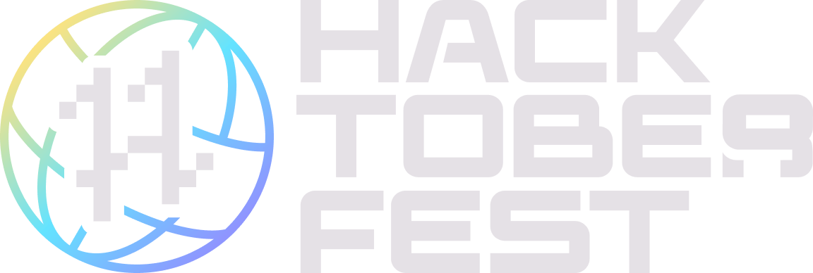

# Hacktoberfest Swag List - 2022

## Let's get prepared for Hacktoberfest 2022

Hello all you beautiful nerds and welcome to another year of [Hacktoberfest](https://hacktoberfest.com/)!

[As the official website states](https://hacktoberfest.com/#prepare-to-hack), Hacktoberfest is a time for everyone to celebrate open-source and come together to make meaningful contributions towards software and organizations you love. Whether this is your first Hacktoberfest or your 9th, everyone can contribute to making open-source software even better!

New for 2022, [low-code or no-code contributions are encouraged](https://hacktoberfest.com/about/#low-or-non-code), so everyone has a chance, regardless of skill level, to contribute and make open-source projects even better!

## What is the Hacktoberfest Swag List?

This site and [GitHub repo](https://github.com/crweiner/hacktoberfest-swag-list) are here to showcase all of the amazing companies that go above and beyond by offering their own swag for the holiday. **The goal of this project is to connect contributors to open-source projects that they might not have heard about before and drive traffic towards organizations that celebrate Hacktoberfest and can use a little more help.**

### This website/repo is not about collecting all of the swag you can. It is about the _open-source community_ and highlighting organizations that purposely want to drive traffic to their projects during Hacktoberfest by offering unique swag

### Swag is an added benefit of helping out these awesome organizations, not the reason for you to contribute in the first place

Participating in Hacktoberfest requires following the [official values](https://hacktoberfest.com/participation/#values), including [**not spamming** the participating companies](https://hacktoberfest.com/participation/#spam).

---

## Sponsored By:

[Appwrite](https://hacktoberfest.appwrite.io/?utm_source=web&utm_medium=swaglist&utm_campaign=hacktoberfest) is a proud sponsor of _all of Hacktoberfest_, as well as the Hacktoberfest Swag List! They understand the importance of connecting developers to open-source projects that could use some help.
Appwrite is a self-hosted backend-as-a-service platform that provides developers with all the core APIs required to build any application.

---

### I understand, let's get started helping for Hacktoberfest 2022!

This year, the Swag List is a little different, so be sure to read about how to [Contribute before submitting a PR](contributing.md).

## [Click here to be taken to the 2022 Hacktoberfest Swag List!](list.md)

---

_Disclaimer_: This website is a fan and community made creation. It is not affiliated with [Hacktoberfest](https://hacktoberfest.com/) or any company offering swag.

---

If you're looking for the Swag List from 2018 through 2021 [click here](https://github.com/crweiner/hacktoberfest-swag-list/releases) for the GitHub releases, [click here](https://github.com/crweiner/hacktoberfest-swag-list/tags) for the tags, and see the [2018](https://github.com/crweiner/hacktoberfest-swag-list/tree/2018), [2019](https://github.com/crweiner/hacktoberfest-swag-list/tree/2019), [2020](https://github.com/crweiner/hacktoberfest-swag-list/tree/2020), and [2021](https://github.com/crweiner/hacktoberfest-swag-list/tree/2021) branches.
