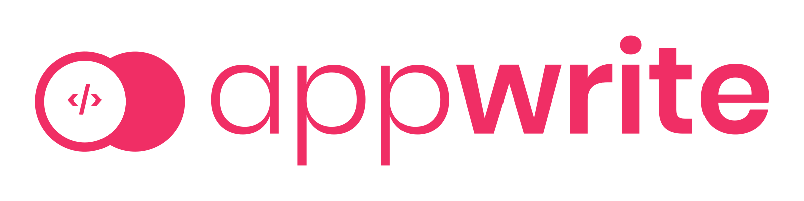
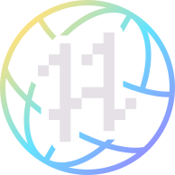

# The List of Companies Offering Unique Swag - Hacktoberfest 2022

## Hacktoberfest is about making meaningful contributions to open source projects. SPAM for the sake of a T-shirt will not be tolerated

First, [sign up for Hacktoberfest 2022 by clicking this link](https://hacktoberfest.com/) Then, [read about how to participate in a meaningful way in the FAQ](https://hacktoberfest.com/participation/).

See [**Contributing.md**](./contributing.md) to see how to format your pull request to add a company's swag to the List!

### Remember: Swag is an added benefit of helping out these awesome organizations, not the reason for you to contribute in the first place!

---

## Sponsored By:

[](https://hacktoberfest.appwrite.io/?utm_source=web&utm_medium=swaglist&utm_campaign=hacktoberfest)

[Appwrite](https://hacktoberfest.appwrite.io/?utm_source=web&utm_medium=swaglist&utm_campaign=hacktoberfest) is a proud sponsor of *all of Hacktoberfest*, as well as the Hacktoberfest Swag List! They understand the importance of connecting developers to open-source projects that could use some help.
Appwrite is a self-hosted backend-as-a-service platform that provides developers with all the core APIs required to build any application.

---

## Swag List 2022

### **The Original - DigitalOcean, Appwrite, and Docker**

- **Swag**: T-shirt, stickers
- **Requirements**: 4 pull requests in any eligible [repository](https://github.com/topics/hacktoberfest)
- **How to sign up**: [Hacktoberfest Website](https://hacktoberfest.com)
- **Notes**: For your PR to count it must be:
  - Submitted in a public repo, AND
    - The PR is labelled as ```hacktoberfest-accepted``` by a maintainer, OR
  - Submitted in a repo labelled ```hacktoberfest```, AND
    - Merged, OR
    - Approved

## A to Z Order of Companies

## A

### **Airbyte**

- **Swag**:
     - First place will receive $1,500 and an exclusive Airbyte gold swag pack.
     - Second place will receive $1,000 and an exclusive Airbyte silver swag pack.
     - Third place will receive $750 and exclusive Airbyte bronze swag pack.
     - Anyone who submits a connector within the event dates will receive $500 and Airbyte swag
- **Requirements**:
     - Must follow all guidelines on the project repo [Guidelines.md](https://github.com/airbytehq/connector-contest/blob/main/GUIDELINES.md).
     - PRs merged before 2nd Of November 2022 only will be taken in consideration.
     - Must have proper documentation for getting started and usage.
     - Must include a sandbox account for integration tests.
- **How to sign up**:  Check out the [Airbyte website](https://airbyte.com/connector-contest) for more details.
- **Issues**: Their [Hacktoberfest Issues](https://github.com/airbytehq/connector-contest/issues) are tagged here.
- **Notes**: Join their [Hacktoberfest Slack channel](https://join.slack.com/share/enQtNDEzMjUzNTQ5OTg0Ny0xN2I2MDU4NGFkOTNlYzZlN2JmMGIzOTgyMjU1ODk1MDIzZWM5YTAzMThkMDFkNzgzNWNjNzljOGU1MmRhMDIw).

### **Amplication**

- **Swag**: Limited edition Amplication T-Shirt, Coffee Mug, Sticker Sheet.
- **Requirements**:
    - 1-2 Contributions : The Amplication Exclusive Sticker Sheet
    - 3 or more Contributions: A choice between Amplication Exclusive Coffee Mug/T-Shirt
- **How to sign up**: Checkout the [Amplication Hacktoberfest Guidelines](https://github.com/amplication/amplication/issues/4039)
- **Issues**: Every issue on our repository will be counted as Hacktoberfest issue. Visit [here](https://github.com/amplication/amplication/issues/)
- **Note**: We also have non and low code issues open for the community.

### **Appsmith**

- **Swag**: Shirts, hoodies, bluetooth speakers, lunch boxes
- **Requirements**:
    - Code(core issues)
        - 1 accepted pull request earns 4 coins
        - 2 accepted pull requests earns 10 coins
        - 3 accepted pull requests earns 20 coins
    - Low code/No code(templates) - 12 awards are available per category
        - Bronze award earns 4 coins
        - Silver award earns 7 coins
        - Gold award earns 10 coins
- **How to sign up**: Sign up here on [Appsmith's app](https://app.appsmith.com/app/hacktoberfest-2022/about-the-event-633619b89cb3ec2a8a93332c).
- **Issues**: List of [hacktoberfest issues](https://github.com/appsmithorg/appsmith/labels/hacktoberfest)
- **Notes**:
    - Check out the [blog post](https://www.appsmith.com/blog/hacktoberfest-2022-come-on-in-the-low-code-is-fine) for more info.
    - Step 1 : Contribute!
        - Contribute core issues OR no/low code templates on our platform.
    - Step 2 : Win coins!
        - CODE - each accepted PR will earn you more coins.
        - LOW/NO - each contributed template is an entry in the Hacktoberfest contest. We will assign 36 total awards across multiple categories.
    - Step 3: Go shopping!
        - Use your coins in our Swag to choose the prizes that YOU want. They will be prepared and shipped to you.

### **Appwrite**

- **Swag**: Limited edition Appwrite Hacktoberfest T-shirt, Original Appwrite sticker pack, Socks
- **Requirements**:
    - Participants can contribute to open issues, build a demo app, write a blog post or make a tutorial.
    - 1 Contribution : The OG Appwrite sticker pack.
    - 2 Contributions : Limited Edition Appwrite Hacktoberfest + OG stickers.
    - 3 Contributions : Limited Edition Hacktoberfest sticker pack + 2 packs of stickers.
    - 4 Contributions and more : Limited Edition Appwrite Hacktoberfest T-shirt.
- **How to sign up**: Check out the [Appwrite website](https://hacktoberfest.appwrite.io/) for more details.
- **Issues**: List of [Hacktoberfest Labelled Issues](https://github.com/search?q=org%3Aappwrite+org%3Autopia-php+org%3Aopen-runtimes+label%3Ahacktoberfest+created%3A%3E2021-01-01+state%3Aopen&type=issues&s=updated&o=asc).
- **Notes**: Read the [blog post](https://appwrite.io/hacktoberfest) for more info.

### **Aviyel**

- **Swag**: Swag box, Limited edition Hacktoberfest-themed virtual badge
- **Requirements**: The two basic requirements to be eligible is:
    - Participants are requested to create technical content based on the theme of each week and submit it within the deadline.
    - Participants will be eligible for a prize only if they attend at least 2 workshops and make 3 submissions (one each week).
    - Submissions must be original work (Plagiarized content will not be accepted).
- **How to sign up**: Sign up for the [Hacktoberfest with Aviyel form here](https://aviyel.typeform.com/register).
- **Notes**: Additional information regarding Hacktoberfest with Aviyel [can be found in this blog post. It is very extensive, be sure to read it all to meet their qualifications.](https://aviyel.com/post/3738/announcing-hacktoberfest-with-aviyel).

## B

### **Bagisto**

- **Swag**: T-Shirt, Stickers, Notebook, Pen, and Bagisto Elephant
- **Requirements**: Contribute to [Bagisto](https://github.com/bagisto/bagisto) during the month of October and have 4 merged PRs to the Bagisto repo.
- **How to sign up**: Check out the [Bagisto website](https://webkul.com/meetups/hacktober-fest-bagisto-2022/) for more details.
- **Issues**: [Hacktoberfest Labelled Issues](https://github.com/bagisto/bagisto/issues?q=is%3Aopen+is%3Aissue+label%3AHacktoberfest)
- **Notes**:
    - For the PR to count for Bagisto's unique swag, it must be accepted, marked with the `Hacktoberfest` label, and they have added a difficulty level.
    - Read the [blog post for more info](https://webkul.com/meetups/hacktober-fest-bagisto-2022/).

## C

### **Camunda**

- **Swag**: Plant a tree, t-shirt
- **Requirements**:
    - Submit 4 quality pull requests to to any [Camunda repo](https://github.com/orgs/camunda/repositories) or participating [Camunda Community Hub repos](https://github.com/orgs/camunda-community-hub/repositories). Look for the `hacktoberfest` label on the repo.
    - The PRs must receive the `hacktoberfest-accepted` tag.
    - They will also make a donation to [One Tree Planted](https://onetreeplanted.org/) for each person that earns their t-shirt!
- **How to sign up**: Once all 4 PRs are accepted, then [fill out the form here](https://camunda.com/hacktoberfest2022/).
- **Notes**: Additional information regarding their Hacktoberfest participation [can be found on this page](https://camunda.com/hacktoberfest2022/).

### **Chimoney**

- **Swag**: Credit, t-shirt
- **Requirements**: Contribute to [Chimoney Community Projects repo](https://github.com/Chimoney/chimoney-community-projects) during the month of October by tackling a `Hacktoberfest` labeled Issue, and have 4 merged PRs to the Chimoney repo.
- **How to sign up**: You need to create a Chimoney account by following these steps:
    - Create a organization on [Chimoney Dashboard](https://dash.chimoney.io).
    - Send [them an email](mailto:support@chimoney.io) with the name of the organization to approve.
    - Switch to the organization (top right) and go to dev page, you’ll see your keys. It’s `live keys`, for now. No test keys yet.
    - They will add $10 for testing. You can always send $1 to yourself to test and redeem it back to the organization. That way, you always have funds.
- **Notes**:
    - 1 merged PR fixing a `Hacktoberfest` Issue = $25 credit.
    - 4 merged PRs fixing a `Hacktoberfest` Issue = T-shirt and $100 credit.
    - More information [here](https://twitter.com/chimoney_io/status/1576286913723596803?s=48&t=JCGsKCKdKEB_sVfGml2m6w) and on their [Community Repo](https://github.com/Chimoney/chimoney-community-projects).

### **ClueLess**

- **Swag**: T-shirt, certificate for contributing
- **Requirements**: Contribute to the following repositories:
    - [ClueLess Community Website](https://github.com/Clueless-Community/clueless-official-website)
    - [First-Contribution](https://github.com/Clueless-Community/first-contribution)
    - [College API](https://github.com/Clueless-Community/collegeAPI)
    - [Prega.io](https://github.com/Clueless-Community/Prega)
    - [Datasets](https://github.com/Clueless-Community/Datasets)
    - Earn points for your contributions:
        - `hard` issues on any repository earns 25 points
        - `medium` issues on any repository earns 15 points
        - `good first issue` on any repository earns 10 points
        - Bonus 5 points are awarded on contributions for the Clueless official website
- **How to sign up**: Signup on the [Clueless web portal](https://www.clueless.tech/)
    - Each repository will have a separate CONTRIBUTING.md
    - Merged PRs will need to tag a maintainer on their ClueLess profile.
- **Issues**: Issues are tagged with: `hacktoberfest`, `good first issue` in their above repos.
- **Notes**:
    - Check out the [blog post](https://www.clueless.tech/hacktoberfest#) and [community GitHub](https://github.com/Clueless-Community) for more info.

### **Codedamn**

- **Swag**: T-shirt
- **Requirements**: During Hacktoberfest, submit an interactive project to [codedamn/projects repository](https://github.com/codedamn/projects).
- **How to sign up**: [Please read their Readme file here very thoroughly](https://github.com/codedamn/projects#readme).
- **Notes**: In order to participate and win prizes, you have to submit a guided project. A guided project is a breakdown of a project into multiple steps for a beginner/intermediate developer to build. These guided projects can be attempted for free from codedamn IDE.

## D

### **DagsHub**

- **Swag**: Individual swags like t-shirt, stickers, or a full swag bundle, depending on the number of PRs (2 to 10).
- **Requirements**: Contribute to one of the following (or both):
     - Challenge 1: [Papers With Everything](https://github.com/DagsHub/papers-with-everything).
     - Challenge 2: [3D Model Datasets](https://github.com/DagsHub/3D-model-datasets).
- **How to sign up**: Sign up to [DagsHub](https://dagshub.com/user/sign_up?redirect_to=). Also, join their [Hacktoberfest Discord Channel](https://discord.gg/6SsqDCUVeq).
- **Issues**: List of issues for contributing to:
    - [Papers With Everything](https://github.com/DagsHub/papers-with-everything/issues).
    - [3D Model Datasets](https://github.com/DagsHub/3D-model-datasets/issues).
- **Notes**: Additional info regarding the contributions can be found [here](https://dagshub.com/blog/dagshub-x-hacktoberfest-2022/).

### **devICT**

- **Swag**: Stickers
- **Requirements**: Create two PRs in any of the qualifying Wichita repos
- **How to sign up**: Sign in with [Github here](https://devict-hacktoberfest.herokuapp.com/) so they can track your PRs.
- **Notes**: You need to create at least two PRs in any of the  Wichita developer community organizations listed [here](https://devict-hacktoberfest.herokuapp.com/)

## E

### **Encore**

- **Swag**: A pack of 12 Encore stickers
- **Requirements**: Build an app with Encore, tweet your Encore Flow diagram, or contribute to [encoredev/encore](https://github.com/encoredev/encore)
- **How to sign up**: Pick up a [GitHub Issue](https://github.com/encoredev/encore/issues), or check out the [Quick Start](https://encore.dev/docs/quick-start) to build your first Encore app and once you're done post it in our Show & Tell!
- **Notes**: [See the Hacktoberfest blog post and weekly Community Office Hours every Friday](https://community.encore.dev/t/our-new-office-hours-to-kick-off-hacktoberfest/66)

## F

### **Flyte**

- **Swag**: Mug, T-shirt, The North Face® Jacket, Voucher, O'Reilly premium membership
- **Requirements**:
    - Submit 2 pull requests and get them approved/merged to receive a Flyte mug.
    - Submit 3 pull requests and get them approved/merged to receive a Flyte t-shirt.
    - Contribute a plugin to receive a voucher.
    - Submit 3+ pull requests and get them approved/merged to receive The North Face® jacket.
    - One top contributor will receive an O'Reilly's individual premium annual subscription worth $500.
- **How to sign up**: Fill out this [form](https://tally.so/r/nWO7qQ) after you are done with either of the challenges on or before Oct. 31, 2022. Join Flyte's #hacktoberfest-2022 [Slack](https://slack.flyte.org/) channel in case you have queries.
- **Issues**: List of [hacktoberfest-labeled issues](https://github.com/flyteorg/flyte/issues/2917)
- **Notes**: Check out the [blog post](https://blog.flyte.org/meet-flyte-and-unionml-at-hacktoberfest-2022) for more info.

## G

### **The Gita Initiative**

- **Swag**: HardCopy Of The Bhagavad Gita And Stickers
- **Requirements**: Submit 4 PRs and have them merged/accepted.
- **How to sign up**: Add values on the [Gita Initiative repo](https://github.com/gita/gita).
- **Notes**: Check out this [link](https://www.linkedin.com/posts/vedvyas_github-gitagita-bhagavad-gita-in-json-activity-6982314384161140736-o370/) for more info.

### **Globo**

- **Swag**: Globo t-shirt
- **Requirements**:
    - Contribute two Pull Requests to any Open Source project at Globo during the month of October.
    - Ensure that at least one pull request is accepted.
    - The first 100 applicants who complete the minimum requirements will receive a t-shirt.
- **How to sign up**: [Join](https://hacktoberfest.globo.com/login) with your GitHub account.
- **Notes**: Checkout the [official post](https://opensource.globo.com/) for more info.

## H

### **HackSquad**

- **Swag**: Shirts, hoodies, mugs, stickers
- **Requirements**:
    - Join a squad of up to 5 other members or get assigned into a random squad.
    - Each hour the number of merged PRs of each member will be summed up. Each PR is worth 1 point.
    - The top 60 squads will win swag, which is calculated [here](https://github.com/novuhq/hacksquad-background/blob/main/src/services/github/github.service.ts).
- **How to sign up**: Sign up on [HackSquad's app](https://www.hacksquad.dev/) using a GitHub account.
- **Notes**:
    - Swag will take 60-90 days to receive.
    - HackSquad's current leaderboard can be found [here](https://www.hacksquad.dev/leaderboard).

### **Hasura**

- **Swag**: T-shirt and stickers.
- **Requirements**: Submit a PR to solve one or more issues in [Hasura GraphQL Engine](https://github.com/hasura/graphql-engine) or [Hasura’s Learn tutorials](https://github.com/hasura/learn-graphql).
    - PR for a small fix (example: a typo fix) will only qualify for a sticker pack.
- **How to sign up**: An order form link will be sent to you via your PR's comment section.
- **Issues**: [learn-graphql issues](https://github.com/hasura/learn-graphql/issues) and [graphql-engine issues](https://github.com/hasura/graphql-engine/issues).
- **Notes**: For more information, check out [this blog post](https://hasura.io/blog/hasura-joins-hacktoberfest-3rd-year-in-a-row/) and [this blog post too](https://hasura.io/blog/with-hasura-celebrate-open-source-in-style-with-hacktoberfest/).

## I

### **INVERTASE**

- **Swag**: Dash, Zappy, Google Home, FlutterVikings rubber duck, Flutter mug, T-shirt, Stickers pack
- **Requirements**:
    - Submit 1 or more pull requests and get them approved/merged with tag **hacktoberfest-special** to receive a Dash ,Google Home, Zappy, FlutterVikings rubber duck, Flutter mug, T-shirt, stickers pack.
    - Submit 10 or more pull requests and get them approved/merged with tag **hacktoberfest-accepted** to receive a Google Home, Zappy, FlutterVikings rubber duck, Flutter mug, T-shirt, stickers pack.
    - Submit 5 to 10 pull requests and get them approved/merged with tag **hacktoberfest-accepted** to receive a Zappy, FlutterVikings rubber duck, Flutter mug, T-shirt, stickers pack.
    - Submit 4 to 2 pull requests and get them approved/merged with tag **hacktoberfest-accepted** to receive a Flutter mug, T-shirt, stickers pack.
    - Submit 1 pull requests and get them approved/merged with tag **hacktoberfest-accepted** to receive a T-shirt, stickers pack.
- **How to sign up**: Click the ["Sign up with Github" button here](https://invertase.io/community/hacktoberfest) before you start with the challenges on or before Oct. 31, 2022.
- **Issues**: See the list of [hacktoberfest-labeled issues](https://github.com/search?q=org%3Ainvertase+org%3Afluttercommunity+org%3Aatsign-foundation++label%3Ahacktoberfest+created%3A%3E2021-01-01+state%3Aopen&type=Issues).
- **Notes**: Check out the [website](https://invertase.io/community/hacktoberfest) for more info.

## L

### **LambdaTest**

- **Swag**: Swags like t-shirt, sticker pack and a bottle, depending on the number of PRs.
- **Requirements**:
    - Participants can contribute to open issues, documentation, coding, supporting others, running a project, or squashing bugs.
    - 1 Contribution : LambdaTest Sticker pack
    - 3 Contributions : LambdaTest T-Shirt + Sticker pack
    - 5 Contributions and more : LambdaTest T-Shirt + Sticker pack + Bottle
- **How to sign up**: Unsure how they are tracking signups at the moment.
- **Issues**: List of [Hacktoberfest Labelled Issues](https://github.com/LambdaTest/test-at-scale-scripts/issues).
- **Notes**: Read the [blog post](https://www.lambdatest.com/blog/celebrate-hacktoberfest-2022-with-lambdatest/) for more info.

### LocalStack

- **Swag**: Depending on how many contributions you make, you can get:
    - T-Shirt (4 Contributions)
    - T-Shirt + $25 Amazon gift-card (10 Contributions)
    - Gift Box + $50 Amazon gift-card (Best Contribution)
- **Requirements**: Following regular Hacktoberfest rules:
    - Register on the Hacktoberfest website
    - Find a project with the Hacktoberfest tag
    - Contribute to the project by following the Hacktoberfest tag between Oct. 1 and Oct. 30
    - Follow-up if needed with maintainers about pull requests to make sure they are merged before Oct.30
- **How to sign up**: Signup on the [Hacktoberfest website](https://hacktoberfest.com/)
- **Notes**: Checkout the [LocalStack post](https://localstack.cloud/blog/2022-10-01-contribute-to-open-source-with-localstack-hacktoberfest/) for more info.

## M

### **Mattermost**

- **Swag**: Stickers, t-shirt, mug.
- **Requirements**:
    - Everyone who makes one or more contributions to the Mattermost community during Hacktoberfest will receive a pack of custom Mattermost stickers.
    - They will select top contributors to receive a custom Mattermost t-shirt and mug.
- **How to sign up**:
    - Review the [issues here](https://github.com/search?q=org%3Amattermost+type%3Aissues+label%3A%22help+wanted%22&state=open&type=Issues).
    - Browse the issues that are labeled `#hacktoberfest` in their repos and find an issue to tackle.
    - The Mattermost team will review the pull request and let you know if additional work is needed.
    - After they have merged your pull request(s), you can claim your swag.
- **Notes**: More details for the Hackathon prizes and Hacktoberfest details [are on their blog here](https://mattermost.com/blog/hacktoberfest-2022/) and their  [Hacktoberfest landing page here](https://mattermost.com/hacktoberfest/).

### **MedusaJS**

- **Swag**: Stickers, t-shirt, water bottle, hoodie.
- **Requirements**:
    - Participate in a Medusa Hackathon and get Hackathon t-shirts and hoodies.
    - Submit 1 pull request and get it merged to receive Medusa stickers.
    - Submit 2 pull requests and get them merged to receive a Medusa t-shirt and stickers.
    - Submit 3 or more pull requests and get them merged to receive a Medusa t-shirt, stickers and water bottle.
- **How to sign up**:
    - Sign up for a [Hackathon here](https://ky5eo2x1u81.typeform.com/to/oG2DCRg7?typeform-source=hacktoberfestswaglist.com) and review the [Hackathon details](https://github.com/medusajs/medusa/discussions/2280).
    - Browse the issues that are labeled `#hacktoberfest` in their repos and find an issue to tackle.
    - The Medusa team will review the pull request and let you know if additional work is needed.
    - After they have merged your pull request(s), you can claim your swag.
- **Notes**: More details for the Hackathon prizes and Hacktoberfest details [are here](https://medusajs.com/blog/medusa-hackathon).

### **Meilisearch**

- **Swag**: Reusable Bottles, Stickers (possibly? Awaiting updated swag for 2022.)
- **Requirements**:
    - Submit 1 or more pull requests to qualify as a contributor. Check out the [Contributing Guidelines](https://github.com/meilisearch/.github/blob/main/Hacktoberfest_2022_contributors_guidelines.md) for more details.
- **How to sign up**: Join the [Slack community](https://www.notion.so/6cd1509802984122ab74745f637b694f) and the [#hacktoberfest channel](https://meilicommunity.slack.com/archives/C02G1H43J2X) to connect with Meilisearch employees and for any queries.
- **Issues**: See the list of [hacktoberfest-labeled issues](https://github.com/search?q=org%3Ameilisearch+label%3Ahacktoberfest&state=open&type=Issues).
- **Notes**: Check out the [blog post](https://blog.meilisearch.com/contribute-hacktoberfest-2022/) for more info.

### **Metafy**

- **Swag**: NFT and T-shirts
- **Requirements**:
    - Submit one or more pull requests to Metafy's repositories with the `hacktoberfest` label to qualify as a contributor. Top contributors will get their very own NFT and T-shirts from Metafy. Check out the [Documentation on their GitHub README File](https://github.com/metafy-social/.github/blob/main/profile/README.md) for more details.
- **How to Sign up**:
    - Register on the [Hacktoberfest website](https://hacktoberfest.com/) anytime between September 26 and October 31, 2022.
    - Contribute with PR/MRs to Metafy's `hacktoberfest` labelled repositories during the period from October 1 to October 31, 2022.
    - The Metafy team will review your PRs constantly and give you feedback.
- **Notes**:
    - Join the [Metafys's Discord Server](https://discord.com/invite/AqnaGBGAUt) to find additional details or connect with Metafy's employees.

### **MindsDB**

- **Swag**: Razer Blade 15 Laptop, T-shirt, cool audio gadgets, and a cash prize.
- **Requirements**:
    - For every 10 points, you will receive one entry into the draw for the awesome Razer Blade 15 Laptop powered by the top NVIDIA GeForce RTX 3080 Ti GPU, 14-core Intel i9 CPU and more. You can also win one of the 10 gadgets of your choice: JBL Earbuds or Rugged Outdoor Speaker.
    - Entries will close at midnight (PST) Monday, 31st of October with the winner announced on the first week of November.
    - To participate, you need to have your GitHub PRs merged and complete the form with your details.
    - Share a well-described idea of a new MindsDB integration. The authors of top upvoted ideas will get a T-shirt, cool audio gadgets, and a cash prize:
        - 1st place: $500
        - 2nd place: $300
        - 3rd place: $200
    - Authors of the top 3 upvoted ideas and top 3 video tutorials or winners of the prize draw, will get the gadget they like – either JBL Wireless Earbuds or Rugged Outdoor Speaker.
- **How to sign up**: Please complete the form below to participate in the prize draw. You should complete the form just once with all your contributions listed. You will be able to edit your responses after submission. [The form can be found here](https://docs.google.com/forms/d/e/1FAIpQLSeyuQGpu-gmVAbXPXMsT5bfFQk28qGNHlsOjz9kkHmgyQEFOw/viewform).
- **Notes**: Check out their [Hacktoberfest webpage](https://mindsdb.com/hacktoberfest/) for more info about earning points.

### **Modtoberfest**

- **Swag**: Prize pack includes stickers and pins. They will also plant 1 [tree](https://modtoberfest.com/modtoberforest) for each valid PR.
- **Requirements**:
    - You must sign up before the end of October 2022.
    - Pull requests must be made during October 2022.
    - Only pull requests against GitHub repositories on the [participating projects list](https://modtoberfest.com/repositories) count towards your progress in the challenge.
    - You must submit pull requests to at least four different [repositories](https://modtoberfest.com/repositories).
    - Pull requests must meet the quality standards.
    - Rewards and prizes for completing the challenge are limited to one per person.
- **How to sign up**: Sign up [here](https://modtoberfest.com/api/auth/signin) to participate.
- **Notes**:
    - Join the [Modtoberfest Discord channel](https://discord.modtoberfest.com/).
    - Some, but not all, of the Modtoberfest repos are also participating in Hacktoberfest.

## N

### **NativeScript**

- **Swag**: Exclusive NativeScript Swags
- **Requirements**:
    - Create a StackBlitz of anything fun or neat about [NativeScript](https://preview.nativescript.org).
    - Contribute a PR for an issue in a participating NativeScript repository.
    - Share a gist of neat NativeScript code you find useful.
    - Create a NativeScript plugin.
    - Tweet about it and mention @[NativeScript](https://twitter.com/NativeScript).
- **How to sign up**:
    - Contribute with PR/MRs to NativeScript's `hacktoberfest` labelled repositories during the period from October 1 to October 31, 2022.
    - The NativeScript team will review your PRs and give you feedback.
    - DM your address to the [NativeScript Twitter account](https://twitter.com/NativeScript) after you've qualified for their swag.
- **Notes**: More details for the prizes [are here](https://twitter.com/NativeScript/status/1577660072150196224).

### **Network to Code and Nautobot**

- **Swag**: NTC & Nautobot swag including shirt(s), stickers, mugs, and more.
- **Requirements**: There will be different prizes for each of the following groups.    
    - New Contributors and all qualifying video submissions.
    - Most Diverse Contributions (qty of repos).
    - Most lines of code changed (across repos).
    - Most bugs closed (PRs opened and approved).
    - Most docs updated (PRs opened and approved).
- **How to sign up**: To participate in Hacktoberfest there's no need to sign up, all you need to do is submit pull request(s) for a qualifying repo.
- **Notes**: Check out [here](https://blog.networktocode.com/post/hackathon/) for more info.

### **Neo4j**

- **Swag**: Pixoo display (might only be 1?)
- **Requirements**:
    - Code: Accepted PRs on GitHub repositories labeled with `hacktoberfest` or the following repositories to update drivers
        - [Java](https://github.com/neo4j-graphacademy/app-java)
        - [JavaScript/Node](https://github.com/neo4j-graphacademy/app-nodejs)
        - [Python](https://github.com/neo4j-graphacademy/app-python)
        - [Go](https://github.com/neo4j-graphacademy/app-go)
        - [.Net](https://github.com/neo4j-graphacademy/app-dotnet)
    - No code/Low code:
        - Most of the Neo4j docs, developer guides, and knowledge base articles have an `Edit This Page` link on the top right.
        - Use this to help fix typos, clarify explanations, add code-examples and more.
        - Clicking the `Edit This Page` link will open up a Github editor where you can make changes and open Pull Request.
        - Once you are done, please ask the maintainer of the repository to mark your contribution with a `hacktoberfest-accepted` label and once merged, this will count towards your four contributions.
    - At the end of the month, Neo4j will give out a  Pixoo display for the best contribution. Tweet your pull requests with #hacktoberfest #neo4j and they will pick the winner in November.
- **How to sign up**: No specific sign up required.
- **Issues**: See the Issues in the repos above.
- **Notes**: Check out the [medium blog post](https://medium.com/neo4j/hacktoberfest-at-neo4j-9991ccc98c33) for more info.

### **Novu**

- **Swag**: T-shirt, Sticker Pack.
- **Requirements**:
    - Submit 3 pull requests to the [Novu repository](https://github.com/novuhq/novu) and get them merged to receive the Special Novu swag pack.
- **How to sign up**:
    - No Special Sign-ups required.
    - You can simply visit their repository [here](https://github.com/novuhq/novu) and pick up any available issue to submit a PR.
    - The Novu team will review the pull request and let you know if any changes are needed.
    - After they have merged your 3 pull requests, you will be contacted over a GitHub discussion thread to claim your swag.
- **Issues**: See the list of available Hacktoberfest issues [here](https://github.com/novuhq/novu/issues?q=is%3Aissue+is%3Aopen+label%3AHacktoberfest).
- **Notes**: More details for the prizes [are here](https://twitter.com/novuhq/status/1576536573436637186). Also, you can join the official Novu Hacktoberfest kickoff on 3rd October 2022 by joining [here](https://discord.gg/K747c2mb?event=1025547200559861810). Join their [Discord](https://discord.gg/novu) if you have any further queries.

## O

### **OpenSearch**

- **Swag**: T-shirt, Sticker Pack, Water Bottle
- **Requirements**:
    - Everyone who makes one or more contributions to the [OpenSearch](https://github.com/search?q=topic%3Ahacktoberfest+org%3Aopensearch-project+fork%3Atrue&type=repositories) community during Hacktoberfest will be eligible for a free OpenSearch sticker.
    - The top 5 points scorers on the community leader board will get a swag pack that will include a water bottle, sweatshirt, and a sticker pack.
    - To get points for your contribution you must open an issue on GitHub and it must be tagged Hacktoberfest with the exception of the forum answers.
    - To get credit for off platform blogs submit a link to your blog in an issue on the [opensearch-project/project-website](https://github.com/opensearch-project/project-website) repo and ask for it to be tagged Hacktoberfest.
    - Points for contributions are distributed as follows:
        - Feature: 10
        - Bug fix: 6
        - On-Platform blog: 5
        - Off-Platform blog: 5
        - Docs: 4
        - Forum answer: 3 (+2 if marked as solution)
- **How to sign up**:
    - You can simply visit one of their repositories [here](https://github.com/search?q=topic%3Ahacktoberfest+org%3Aopensearch-project+fork%3Atrue&type=repositories) and pick up any available issue to submit a PR.
    - The OpenSearch team will review the pull request and let you know if any changes are needed.
- **Issues**: See the list of available Hacktoberfest issues [here](https://github.com/search?q=topic%3Ahacktoberfest+org%3Aopensearch-project+fork%3Atrue+label%3A%22hacktoberfest%22+is%3Aissue+is%3Aopen&type=Issues).
- **Notes**: More details about the prizes [are here](https://opensearch.org/blog/community/2022/10/hacktoberfest-2022/). Join their [Forum](https://forum.opensearch.org/t/hacktoberfest-2022/11129) if you have any further queries. They are also active on [Twitter](https://twitter.com/OpenSearchProj).

## P

### **Percona**

- **Swag**: Percona T-shirt or a hat.
- **Requirements**:
    - Submit at least 4 pull/merge requests that are:
        - Following the [official Hacktoberfest PR/MR conditions](https://hacktoberfest.com/participation/#pr-mr-details).
        - Getting accepted to any of the participating [Percona Github Repos](https://github.com/search?q=org%3Apercona+topic%3Ahacktoberfest).
- **How to sign up**:
    - Register on the [Hacktoberfest website](https://hacktoberfest.com/) anytime between September 26 and October 31, 2022.
    - Explore the [participating projects](https://github.com/search?q=org%3Apercona+topic%3Ahacktoberfest) and choose your favorites. Contribute with PR/MRs during the period from October 1 to October 31, 2022.
    - The Percona team will review your PRs constantly and give you feedback.
- **Issues**:
    - [Percona Github Issues](https://github.com/search?q=org%3Apercona+topic%3Ahacktoberfest+is%3Aissue+is%3Aopen&type=Issues)
    - [Percona JIRA Issues](https://jira.percona.com/issues/?jql=resolution%20%3D%20Unresolved%20AND%20status%20%3D%20Open%20AND%20description%20is%20not%20EMPTY%20AND%20project%20in%20(%22Percona%20Monitoring%20and%20Management%22%2C%20%22Percona%20Operator%20for%20MongoDB%22%2C%20%22Percona%20Operator%20for%20MySQL%22%2C%20%22Percona%20Operator%20for%20MySQL%20based%20on%20Percona%20XtraDB%20Cluster%22%2C%20%22Percona%20Operator%20for%20PostgreSQL%22)%20ORDER%20BY%20created%20DESC)
- **Notes**: Additional information regarding Hacktoberfest with Percona can be found in this [blog post](https://www.percona.com/blog/contribute-to-open-source-with-percona-and-hacktoberfest/).

### **Pusher**

- **Swag**: One item, two items, or full Pusher Hacktoberfest swag pack.
- **Requirements**:
    - Submit 1 pull request and get it merged to receive one item from the Pusher Hacktoberfest swag pack.
    - Submit 2 pull requests and get them merged to receive two items from the Pusher Hacktoberfest swag pack.
    - Submit 3 or more pull requests and get them merged to receive the full Pusher Hacktoberfest swag pack.
- **How to sign up**:
    - Fork the README.MD file in the [pusher/hacktoberfest repo](https://github.com/pusher/hacktoberfest) and make PR with a link to what you’ve worked on and an email address so they can reach out to you to claim your swag.
    - You will receive a review, comment, and approval by a member of the Pusher team within a couple of days. All PRs accepted by the team will be marked as ‘hacktoberfest-accepted’ by October 31st.
- **Notes**: More details [in the Pusher Hacktoberfest repo here](https://github.com/pusher/hacktoberfest/blob/main/README.md)

## R

### **RapidAPI**

- **Swag**: RapidAPI Swag (Unspecified)
- **Requirements**:
    - Write about the RapidAPI products. Each blog will earn you 2 points.
    - Write tweets or threads. Each tweet earns 1 point. You can get only 1 point from Twitter. You will get one more point if the tweet/thread has more than 500 likes.
    - Publish YouTube videos about APIs. Each video on YouTube will earn you 2 points. If your video has more than 1k views, you will get two additional points.
    - Run an API development meetup. Talk about using RapidAPI VS Code extension or hosting APIs on RapidAPI Hub. Each meetup will earn you 4 points.
- **How to sign up**: Submit your application to win swags from RapidAPI using the [contact form](https://docs.google.com/forms/d/e/1FAIpQLScBao9QuBPjAOgNK_2cCe2_8Y40dqvkS8f0DMpst-WopZOg8w/viewform?usp=sf_link)
- **Notes**: Only the first 50 participants who complete the challenge will be chosen as winners. For more details visit the [page](https://rapidapi.com/learn/hacktoberfest).

### **Refine**

- **Swag**: T-shirt, cap, bottle.
- **Requirements**:
    - Submit 1 pull request to the [refine repository](https://github.com/pankod/refine) and get it merged to receive a refine T-shirt.
    - Submit 2 pull requests and get them merged to receive a complete refine Swag Kit: T-shirt, cap & bottle.
- **How to sign up**:
    - Register on the [Hacktoberfest website](https://hacktoberfest.com/) anytime between September 26 and October 31, 2022.
    - Pick one of the issues in refine repository, submit a pull request and get it merged.
- **Issues**: Here you can find a [list of Hacktoberfest labeled issues](https://github.com/pankod/refine/labels/hacktoberfest) in refine repository.
- **Notes**: More details [in the refine blogpost here](https://refine.dev/blog/hacktoberfest-refine/)

## S

### **Space Jelly and Cloudinary**

- **Swag**: Space Jelly Sticker Pack, Cloudinary Sticker Pack, Cloudinary Plush Unicorn
- **Requirements**:
    - Submit 1 pull request and get it merged to receive Space Jelly Sticker Pack in the [Next.js WordPress Starter Repo](https://github.com/colbyfayock/next-wordpress-starter).
    - Submit 1 pull request and get it merged to receive Space Jelly Sticker Pack, Cloudinary Sticker Pack, and Cloudinary Plush Unicorn in the [Cloudinary Next.js Image Component repo](https://github.com/colbyfayock/next-cloudinary) OR [Cloudinary Netlify Plugin Repo](https://github.com/colbyfayock/netlify-plugin-cloudinary).
- **How to sign up**:
    - Register on the [Hacktoberfest website](https://hacktoberfest.com/) anytime between September 26 and October 31, 2022.
- **Notes**: More details [on their Hacktoberfest page here](https://spacejelly.dev/hacktoberfest/).

### Speckle

- **Swag**: Speckle swag (stickers)
- **Requirements**: Get 4 pull requests accepted in any of the Speckle repositories.
- **How to sign up**: No special sign-ups required.
- **Issues**: Find all Speckle repos [in this Hacktoberfest GitHub project view here.](https://github.com/orgs/specklesystems/projects/14/views/1).
- **Notes**: More details can be found in [this blog post.](https://speckle.community/t/hacktoberfest-2022-with-speckle/3641)

### **Steampipe**

- **Swag**: Stickers, t-shirt
- **Requirements**:
    - 1 Non-code contribution for a Steampipe Hacktoberfest sticker.
    - 1 Low-code contribution for a next-level Steampipe Hacktoberfest sticker.
    - 1 High-code contribution for a Steampipe Hacktoberfest t-shirt.
    - 1 Advanced high-code contribution for a next-level Steampipe Hacktoberfest t-shirt.
- **How to sign up**: No Special Sign-ups required. You can simply visit their repository [here](https://github.com/turbot/steampipe) and pick up any available issue to submit a PR.
    - The Steampipe team will review the pull request and let you know if any changes are needed.
- **Notes**: For more details [their Hacktoberfest page](https://steampipe.io/blog/hacktoberfest-2022).

### **SuiteCRM**

- **Swag**: T-shirt, stickers, SuiteCRM-branded mug
- **Requirements**: Unsure as to number of PRs required at this time.
- **How to sign up**: Unsure how they're tracking signups at this time.
- **Issues**: [SuiteCRM](https://github.com/salesagility/SuiteCRM/labels/Hacktoberfest), [SuiteCRM-Core](https://github.com/salesagility/SuiteCRM-Core/labels/Hacktoberfest), [SuiteDocs](https://github.com/salesagility/SuiteDocs/labels/Hacktoberfest)
- **Notes**: For more details [see their Hacktoberfest community post](https://community.suitecrm.com/t/hacktoberfest-2022/86484)

## T

### **ToolJet**

- **Swag**: Stickers, t-shirt, water bottle, hoodie
- **Requirements**:
    - Submit 1 valid PR and get ToolJet stickers and t-shirt.
    - Submit 3 valid PRs and get ToolJet stickers, t-shirt, and water bottle.
    - Submit 4 valid PRs and get ToolJet stickers, t-shirt, hoodie, and water bottle.
    - Also, the top 5 contributors will get a surprise gift this time!
- **How to sign up**:
    - First [Sign up here](https://app.tooljet.com/signup).
    - Find an issue you can work according to the description and labels.
    - Get it assigned to yourself and then only raise a corresponding PR.
- **Issues**: List of all [Hacktoberfest-labeled-issues](https://github.com/ToolJet/ToolJet/labels/hacktoberfest).
- **Notes**:
    - Checkout [this blog post](https://blog.tooljet.com/hacktoberfest-2022/).
    - For help, join their [Slack](https://tooljet.com/slack).

## U

### **UnionML**

- **Swag**: Tumbler, Voucher, Hoodie, O'Reilly premium membership
- **Requirements**:
    - Submit 2/3 pull requests and get them approved/merged to receive a voucher or Union tumbler.
    - Submit 3+ pull requests and get them approved/merged to receive a Union hoodie.
    - One top contributor will receive an O'Reilly's individual premium annual subscription worth $500.
- **How to sign up**: Fill out this [form](https://tally.so/r/nWO7qQ) after you submit a pull request on or before Oct. 31, 2022. Join Flyte's #hacktoberfest-2022 [Slack](https://slack.flyte.org/) channel in case you have queries.
- **Issues**: List of [hacktoberfest-labeled issues](https://github.com/unionai-oss/unionml/issues/171)
- **Notes**: Check out the [blog post](https://blog.flyte.org/meet-flyte-and-unionml-at-hacktoberfest-2022) for more info.

### **Uno**

- **Swag**: Hoodie, T-shirt, eBook
- **Requirements**:
    - Submit 2 Quality Pull Requests for Getting Started with the Uno Platform and WinUI 3 eBook.
    - Submit 4 Quality Pull Requests for a Uno Platform T-shirt.
    - Submit 10 Quality Pull Requests for a Uno Platform Hoodie.
- **How to sign up**:
    - Tackle an [open issue](https://github.com/unoplatform/uno/issues), review the list of [documentation and code samples that need some help](https://github.com/orgs/unoplatform/projects/77/views/1), or submit an advocacy contribution (see the blog post).
- **Issues**:
    - List of [hacktoberfest issues](https://github.com/unoplatform/uno/labels/hacktoberfest)
    - List of [open issues](https://github.com/unoplatform/uno/issues)
    - List of [documentation contributions](https://github.com/orgs/unoplatform/projects/77/views/1)
    - List of [advocacy contributions](https://github.com/unoplatform/uno/blob/master/doc/articles/guides/community-tutorials.md)
- **Notes**:
    - Check out the [blog post](https://platform.uno/blog/uno-platform-at-hacktoberfest-2022-prizes-and-how-to-participate/) for more info.

---

*Disclaimer*: This website is a fan and community made creation. It is not affiliated with [Hacktoberfest](https://hacktoberfest.digitalocean.com/) or any company offering swag.



---

If you're looking for the Swag List from 2018 through 2021 [click here](https://github.com/crweiner/hacktoberfest-swag-list/releases) for the GitHub releases, [click here](https://github.com/crweiner/hacktoberfest-swag-list/tags) for the tags, and see the [2018](https://github.com/crweiner/hacktoberfest-swag-list/tree/2018), [2019](https://github.com/crweiner/hacktoberfest-swag-list/tree/2019), [2020](https://github.com/crweiner/hacktoberfest-swag-list/tree/2020), and [2021](https://github.com/crweiner/hacktoberfest-swag-list/tree/2021) branches.
