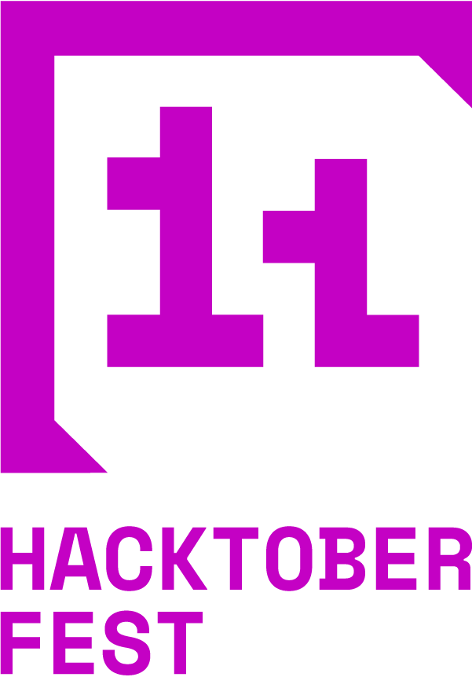

# The List of Companies Offering Unique Swag - Hacktoberfest 2024

## Hacktoberfest is about making meaningful contributions to open source projects. SPAM for the sake of swag will not be tolerated

First, [sign up for Hacktoberfest 2024 by clicking this link](https://hacktoberfest.com/) Then, [read about how to participate in a meaningful way in the FAQ](https://hacktoberfest.com/participation/).

See [**Contributing.md**](./contributing.md) to see how to format your pull request to add a company's swag to the List!

### Remember: Swag is an added benefit of helping out these awesome organizations, not the reason for you to contribute in the first place!

---

## Sponsored By:

[](https://tscircuit.com/?utm_source=hacktoberfestswaglist&utm_medium=website&utm_campaign=logo)

[tscircuit](https://tscircuit.com/?utm_source=hacktoberfestswaglist&utm_medium=website&utm_campaign=list) [(GitHub)](https://github.com/tscircuit/tscircuit)
is a framework that allows you to build electronic circuit boards,
schematics and PCB layouts with React, Typescript and AI tools. We do live stream
development and love to chat with contributors on our [discord](https://tscircuit.com/join).
Check out our [Hacktoberfest Getting Started Guide](https://blog.tscircuit.com/p/build-electronics-with-typescript).
MIT-licensed open-source

## Swag List 2024

### **The Original - DigitalOcean, Cloudflare, and Quira**

- **Swag**: [Digital Rewards Kit](https://hacktoberfest.com/about/#rewards)
- **Requirements**: 4 pull requests in any eligible [repository](https://github.com/topics/hacktoberfest)
- **How to sign up**: [Hacktoberfest Website](https://hacktoberfest.com)
- **Notes**: For your PR to count it must be:
  - Submitted in a public repo, AND
    - The PR is labelled as ```hacktoberfest-accepted``` by a maintainer, OR
  - Submitted in a repo labelled ```hacktoberfest```, AND
    - Merged, OR
    - Approved

## A to Z Order of Companies

### A

#### **Animata**

- **Swag**: $50 reward through a raffle system
- **Requirements**:
    - Contribute to the open issues labeled `hacktoberfest`.
    - Ensure your PR follows the [contributing guidelines](https://www.animata.design/docs/contributing).
    - Link to the issue number in your PR and add relevant labels.
    - Based on the difficulty of easy, medium, hard or advanced, earn 1,2,3 or 4 entries respectively in the raffle.
    - Maximum of 5 entries per user for the raffle.
    - You must be able to receive international payments via platforms like PayPal.
- **How to sign up**: No signup needed.
- **Issues**: Open issues with label `hacktoberfest` on the [Github Project Board](https://github.com/orgs/codse/projects/37/views/2).
- **Notes**: Read the [Animata Design Blog post](https://animata.design/blog/hacktoberfest-2024) for more details.

#### **Appwrite**

- **Swag**:
  - 1st place team: [The Appwriter keyboard](https://appwrite.store/products/preorder-the-appwriter)
  - 2nd and 3rd place teams: an Appwrite swag kit.
- **Requirements**: Create a brand-new project using Appwrite, specifically one that is creative and innovative.
- **How to sign up**: Join the hackathon with up to 4 people total [by going here](https://hacktoberfest.appwrite.io/).
- **Notes**: Read the [Hacktoberfest 2024 hackathon blog post here](https://appwrite.io/blog/post/appwrite-hacktoberfest-hackathon-2024).

#### **Auth0 by Okta**

- **Swag**: T-shirt
- **Requirements**: Submit two pull requests in the Identity and Security space shortlisted on the authoberfest projects page. First 100 valid submissions which are accepted or merged by October 31 will qualify to win the swag.
- **How to sign up**: No signup required.
- **Issues**: [Featured Projects](https://authtoberfest.io/#g-430503226)
- **Notes**:  Once you have two merged requests, send the merge confirmation emails and the Hacktoberfest Digital Badge showing the progress to <authoberfest@auth0.co>. Submissions can be sent until 30th November. Read more at [Authoberfest](https://authtoberfest.io/).

### B

#### **Ballerina**

- **Swag**: Swag from [Ballerina Swage store](https://store.covver.io/wso2/collections/ballerina-swag-store)
- **Requirements**: Collect credits by [fixing issues in their Hacktoberfest 2024 project](https://github.com/orgs/ballerina-platform/projects/376). Spend those credits in their [swag store](https://store.covver.io/wso2/collections/ballerina-swag-store).
- **How to sign up**: If your PR is merged, then [submit this form](https://forms.gle/517ebK579YwmPfRY6) to earn your credits.
- **Notes**: [Check out the Ballerina Hacktoberfest page here](https://ballerina.io/hacktoberfest/).

### C

#### **Chimoney**

- **Swag**: Digital Badge, Reward of $10, T-shirt.
- **Requirements**: All contributions earn a digital badge, meaningful PRs earn $10, and 4 merged PRs for substantial contributions earn a t-shirt.
- **How to sign up**:
    - Sign up for an Chimoney Developer Account to get the API Keys to get started. [For more info](https://community-chimoney.hashnode.dev/getting-started-with-chimoneys-api-chiconnect).
    - For technical writers, please submit your PR in the [submissions/dev-focused-articles](https://github.com/Chimoney/chimoney-community-projects/tree/main/submissions/Dev%20focused%20articles) folder.
    - For other contributions, submit your PR in the general [submissions](https://github.com/Chimoney/chimoney-community-projects/tree/main/submissions) folder
- **Issues**: List of available [issues](https://github.com/Chimoney/chimoney-community-projects/issues).
- **Notes**: Check out their [README](https://github.com/Chimoney/chimoney-community-projects?tab=readme-ov-file#chimoney-rewards) for more info.

#### **Cloudinary**

- **Swag**: T-shirt, Stickers, Cloudinary unicorn.
- **Requirements**: Make a valid PRs in eligible Cloudinary libraries and SDKs. The first 50 eligible submissions will receive a Swag Kit.
- **How to sign up**: No special signup known.
- **Notes**: [Visit Cloudinary](https://cloudinary.com/blog/hacktoberfest-open-source-celebration-cloudinary) for the list of eligible libraries and SDKs.

#### **Composio**

- **Swag**: Stickers, T-shirt
- **Requirements**: 4 accepted/merged PRs against `hacktoberfest` topics in any of the Composio repositories.
- **How to sign up**: No signup link known
- **Issues**: [Hacktoberfest tagged issues in the Composio repo](https://github.com/ComposioHQ/composio/issues?q=is%3Aopen+is%3Aissue+label%3Ahacktoberfest)
- **Notes**: [Check out their announcement post for more information.](https://github.com/ComposioHQ/composio/blob/master/HACKTOBER_FEST_2024.md)

#### **Configu**

- **Swag**: T-shirt and/or Beer Glass.
- **Requirements**:
    - 1 Valid Pull Request: Receive an exclusive Configu Beer Glass.
    - 2 Valid Pull Requests: Secure a LIMITED-EDITION Configu Hacktoberfest T-shirt.
    - 3+ Valid Pull Requests: Get both the Configu Beer Glass and the LIMITED-EDITION Hacktoberfest T-shirt!
- **How to sign up**: No special signup known.
- **Issues**: Contribute to any issue in the [Configu Repository](https://github.com/configu/configu).
- **Notes**: Check out this [GitHub Issue](https://github.com/configu/configu/issues/465) for more details.

#### **CopilotKit**

- **Swag**: CopilotKit swag
- **Requirements**:
    - Create innovative demos for CopilitKit to earn points from 0 to 100 based on creativity, practicality, quality and UI/UX.
    - Swag is only available if you complete a demo.
- **How to sign up**: No signup needed.
- **Issues**: [Open issues](https://github.com/CopilotKit/CopilotKit/issues?q=sort%3Aupdated-desc+is%3Aissue+is%3Aopen+label%3Ahacktoberfest) with demo ideas with label `hacktoberfest`.
- **Notes**: Check out the [announcement post](https://github.com/CopilotKit/CopilotKit/tree/main/community/content) for more details.

#### **Crawlee for Python**

- **Swag**: Sticker Sheet and Hoodie.
- **Requirements**:
    - 1-2 Accepted Pull Requests: Crawlee Exclusive Sticker Sheet.
    - 2 or more Accepted Pull Requests: Crawlee Exclusive Hoodie.
- **How to sign up**: No signup link known.
- **Issues**: Look for issues tagged  as `hacktoberfest` [here](https://github.com/apify/crawlee-python/issues?q=sort%3Aupdated-desc+is%3Aopen+label%3Ahacktoberfest).
- **Notes**:  [Check out the Crawlee for Python GitHub issue here](https://github.com/apify/crawlee-python/issues/555).

### D

#### **devICT**

- **Swag**: Stickers
- **Requirements**: Submit two pull requests to qualifying Wichita projects
- **How to sign up**: [Sign into your GitHub account here](https://hacktoberfest.devict.org/) and submit two meaningful PRs to the projects on that page.
- **Notes**: N/A

#### **DevFest AI**

- **Swag**: Hoddie, backpack, bottle, cap etc
- **Requirements**:
    - Contribute as a solo member or as a squad.
    - Contribute to AI-based repositories or repositories that have AI features created before October with more than 200 stars.
    - Earn a point with each merged PR.
    - Top 20 squads will be announced winners.
- **How to sign up**: Sign up at [DevFestAI](https://devfest.ai/) with a maximum of 5 members.
- **Notes**: Read more at [DevFest AI](https://devfest.ai/) for more information and attend exclusive events.

#### **DocsGPT**

- **Swag**: T-shirt
- **Requirements**: Top contributors will be rewarded with swag. You can contribute in various ways:
    - Make meaningful contributions through PRs.
    - Build an app using DocsGPT API.
    - Make non-code contributions like improving docs or creating a guide.
    - Improve UI/UX or design a new feature.
    - Blog or create a video showcasing DocsGPT
    - After contributing fill this [form](https://airtable.com/appikMaJwdHhC1SDP/pagoblCJ9W29wf6Hf/form).
- **How to sign up**: No signup needed.
- **Issues**: Check out [open issues](https://github.com/arc53/DocsGPT/issues?q=sort%3Aupdated-desc+is%3Aissue+is%3Aopen) and [roadmap](https://github.com/orgs/arc53/projects/2).
- **Notes**: Read the [announcement post](https://github.com/arc53/DocsGPT/blob/main/HACKTOBERFEST.md) for more details.

#### **dstack**

- **Swag**: up to $500 GPU credits to use with dstack Sky.
- **Requirements**:
    - Fix eligible open issues.
    - Only quality contributions will be reviewed and merged.
    - $15 bounty to fix a minor issue
    - $100 bounty to fix a major issue
    - $500 bounty to fix an advanced issue
- **How to sign up**: No signup needed
- **Issues**: [Open issues](https://github.com/dstackai/dstack/issues/1735) of all levels.
- **Notes**: Checkout the [announcement post](https://github.com/dstackai/dstack/issues/1735) for more details.

### E

#### **Esri**

- **Swag**: Esri Summit registration and discounts
    - 1st Place: Free registration to one Esri Summit of your choice from the following: Esri European Developer Summit 2024, Esri Developer & Technology Summit 2025, or Esri European Developer Summit 2025.Developer Summit 2025.
    - 2nd Place: 75% discount on Esri Summit registration (same event options as above).
    - 3rd Place: 50% discount on Esri Summit registration (same event options as above).
- **Requirements**:
    - At least one merged PR solving either "good first issue" or "help wanted" issue in any Esri-designated project
    - You can earn points for only one “good first issue” per person.
- **Requirements**: [See detailed contest rules here](https://www.esri.com/arcgis-blog/wp-content/uploads/2024/10/2024-Esri-Hacktoberfest-Contest-Official-Rules-2.pdf).
- **How to sign up**: No signup required.
- **Notes**: Read the full blog post with all the details [here](https://www.esri.com/arcgis-blog/products/developers/developers/hacktoberfest-2024-contribute-to-open-source-and-win/)

### F

#### **Flyte**

- **Swag**: T-shirts, stickers, sweatshirts, watter bottles and a pair of Airpods Pro 2
- **Requirements**: At least one merged PR or content contribution (blog post, recorded demo). The more contributions you make, and the more significant the contribution, the greater the prize.
- **How to sign up**: If your PR is merged, then [submit this form](https://tally.so/r/mJJ14r)
- **Notes**: Read the blog post with all the details [here](https://flyte.org/blog/flyte-at-hacktoberfest-2024) and check out the [Flyte Hacktoberfest issues and guidelines here](https://github.com/flyteorg/flyte/issues/5783).

### G

#### **Gradle**

- **Swag**: Special edition Gradle T-shirts, Stickers, Caps or Mugs
- **Requirements**:
    - Top-20 Contributors: Swag Pack (T-shirts, Stickers)
    - Caps and Mugs for substantial contributions
- **How to sign up**: [Fill out this form](https://forms.gle/go2VESj7kDG1QUqV7).
- **Notes**: See their [full Hacktoberfest page here](https://community.gradle.org/events/hacktoberfest/2024/). The team prepared some [Featured Projects](https://community.gradle.org/events/hacktoberfest/2024/#featured-projects) you can participate in.

#### **GUAC**

- **Swag**: GUAC swag
- **Requirements**: Make a successful PR to any of the two participating repos, [GUAC Docs](https://github.com/guacsec/guac-docs) and [GUAC Visualizer](https://github.com/guacsec/guac-visualizer).
- **How to sign up**: No signup needed
- **Issues**:
    - [Open issues](https://github.com/guacsec/guac-docs/issues) at GUAC Docs repo.
    - [Open issues](https://github.com/guacsec/guac-visualizer/issues) at GUAC Visualizer
- **Notes**: Read the [GUAC announcement](https://guac.sh/blog/2024-09-25-hacktoberfest/) for more details.

### H

#### **Hiero**

- **Swag**: T-shirt
- **Requirements**: Contribute to any of the open issues from Heiro repos from beginner to advanced difficulty.
- **How to sign up**: No signup needed.
- **Issues**: List of available [open issues](https://hiero.org/hacktoberfest/)
- **Notes**: Check out the [announcement post](https://hiero.org/hacktoberfest/) for more details or join their [GitHub discussion](https://github.com/orgs/LFDT-Hiero/discussions) to get any of your questions answered.

#### **Hyperswitch**

- **Swag**: Stickers, T-shirt, and/or hoodie
- **Requirements**:
    - 1 merged PR: "Exclusive Hyperswitch swag" (likely stickers)
    - 3+ merged PRs: "Special swag kit" (likely T-shirt and/or hoodie)
- **How to sign up**: No known signup link
- **Issues**: Specifically look for issues [tagged  as "hacktoberfest" here](https://github.com/juspay/hyperswitch/issues?q=is%3Aopen+is%3Aissue+label%3Ahacktoberfest).
- **Notes**: [Check out their dev.to post here for all the details!](https://dev.to/hyperswitchio/hacktoberfest-2024-with-hyperswitch-47dk)

### I

#### **Instill AI**

- **Swag**:
  - Accepted PR: Swag package including physical stickers, Instill bottle or mug.
  - Top Five based on points: $50 USD Amazon gift card
- **Requirements**: Earn points by completing tasks including:
    - GitHub issues from  the [Component Improvements issue list](https://github.com/orgs/instill-ai/projects/14/views/1)
    - New application shared on GitHub
    - Creating Cookbook and PR merged into [Cookbook Repo](https://github.com/instill-ai/cookbook)
- **How to sign up**: Submit work using the [Hacktoberfest Contribution Form](https://forms.gle/YzM5gKVDrjQcJwvD7).
- **Notes**:[Check out their dev.to post for more information](https://dev.to/shihchun-h/announcing-instill-ais-tentaculous-hacktoberfest-2024-3991)

### J

#### **JSToday**

- **Swag**: Stickers
- **Requirements**: Submit at least four merged or accepted pull requests to any public repository on GitHub.
- **How to sign up**:
      - Once you’ve made your contributions, tweet or post on social media tagging @todayJavaScript with the hashtag #Hacktoberfest2024, and a link to your GH profile or PRs.
      - Send them an email with your contributions at: <contact@javascripttoday.com>.
- **Notes**: See the [JSToday Hacktoberfest blog post](https://javascripttoday.com/blog/hacktoberfest-2024-free-sticker/) for more information

### L

#### **Langfuse**

- **Swag**: Stickers and T-shirt
- **Requirements**:
    - 2+ merged PRs: Pack of new Langfuse stickers
    - 2+ merged PRs: Chance to win a Langfuse t-shirt
- **How to sign up**: Sign up [here](https://docs.google.com/forms/d/e/1FAIpQLSe_GNazlvZSkHJ-WdnWOCfplZULY3GTOzCBwZgX7X_mLjlK2A/viewform) if you have >=2 merged PRs in the Langfuse Repo to get your swag
- **Issues**: Look for issues [tagged  as "hacktoberfest" here](https://github.com/langfuse/langfuse/issues?q=is%3Aissue+is%3Aopen+label%3Ahacktoberfest).
- **Notes**: Learn more about [Langfuse on their website](https://langfuse.com/) and [in their repo here](https://github.com/langfuse/langfuse-docs/issues/827).

#### **LambdaTest**

- **Swag**: Amazon Vouchers and LambdaTest Licenses
- **Requirements**:
    - Submit a PR to fix an issue tagged `hacktoberfest` or `good-first-issue` to one of their [supporting projects](https://github.com/LambdaTest/lambdatest-hacktoberfest-2024?tab=readme-ov-file#-projects-you-can-contribute-to)
    - 3 Contributions: Amazon Vouchers (up to $10) + LambdaTest Licenses (90 days)
    - 5+ Contributions: Amazon Vouchers (up to $20) + LambdaTest Licenses (90 days)
- **How to sign up**: No signup link known.
- **Notes**:  [Check out the LambdaTest blog post here](https://github.com/LambdaTest/lambdatest-hacktoberfest-2024).

### M

#### **MindsDB**

- **Swag**: Swag from their store and a drawing for 3 Razer™ Blade laptops
- **Requirements**: Collect credits by [fixing `hacktoberfest` tagged issues in their repo](https://github.com/mindsdb/mindsdb/labels/hacktoberfest). Spend those credits in their swag store. Each 100 credits you earn puts you into the drawing for a laptop.
- **How to sign up**: If your PR is merged, then [submit this form](https://docs.google.com/forms/d/e/1FAIpQLSdk4x-lul0fEeBRTRS7-9Aplr0WOCndOODiZMLCZdrCe1ggEg/viewform) to earn your points.
- **Notes**: [Check out the MindsDB Hacktoberfest page here](https://mindsdb.com/hacktoberfest).

#### **Modtoberfest**

- **Swag**: Stickers. They will also plant [1 tree](https://modtoberfest.com/modtoberforest) for each participant.
- **Requirements**:
    - Only pull requests made in the [participating projects](https://modtoberfest.com/repositories) count towards your progress.
    - You must submit at least 4 PRs to any of the [participating repositories](https://modtoberfest.com/repositories).
- **How to sign up**:  Sign up at [Modtoberfest](https://modtoberfest.com/api/auth/signin) to track your progress.
- **Notes**: FAQ and rules available at [Modtoberfest](https://modtoberfest.com/).

#### **Multiwoven**

- **Swag**: Merch and certificate of contribution
- **Requirements**:
    - Fix issues tagged with `hacktoberfest`
    - Complete three approved PRs to earn the Multiwoven swag.
    - Top contributors will be rewarded special rewards.
- **How to sign up**: No signup needed.
- **Issues**: Issues [tagged for hacktoberfest](https://github.com/Multiwoven/multiwoven/issues?ref=blog.squared.ai).
- **Notes**: Read the [ai squared blog](https://blog.squared.ai/hacktoberfest-2024-celebrate-open-source-with-multiwoven/) for details.

### O

#### **oss.gg**

- **Swag**: MacBook, iPhone, PlayStation, AirPods, Keyboard and a brick
- **Requirements**:
    - Complete [code](https://oss.gg/code) and [non-code](https://oss.gg/non-code) contributions to get points.
    - Each point is a lottery ticket.
    - Lottery happens on 31st October 2024
- **How to sign up**: Sign up at [oss.gg](https://oss.gg/signup)
- **Issues**:
    - All [open issues](https://oss.gg/oss-issues).
    - [Side quests and challenges](https://oss.gg/)
- **Notes**: Read [oss.gg](https://oss.gg/) for more information.

### R

#### **Refact.ai**

- **Swag**: 3 months of free access to the Refact.ai tool
- **Requirements**: Have 1 accepted PR's to [Refact-lsp repository](https://github.com/smallcloudai/refact-lsp)
- **How to sign up**: No separate signup known.
- **Notes**: Know more on the [open issues](https://github.com/smallcloudai/refact-lsp/issues)

#### **Reflex**

- **Swag**: Multiple cash rewards between $50 to $300, swag, and pro hosting service voucher.
- **Requirements**: Complete any of the tasks to win
    - Best use of AG Grid component.
    - Build the most aesthetic Reflex app.
    - Build an app that improves DX of the dev workflow.
    - Wrap various React components in Reflex.
- **How to sign up**: No signup needed
- **Issues**:
    - [$300 Wrap Reactflow](https://github.com/reflex-dev/reactflow).
    - [$250 Wrap React Email](https://github.com/resend/react-email).
    - [$200 Wrap Altair Charts](https://altair-viz.github.io/)
    - [$200 Wrap Bokeh Charts](https://bokeh.org/)
- **Notes**: Read the [Reflex Dev Hacktoberfest](https://github.com/reflex-dev/hacktoberfest) for more details.

#### **Robo.js**

- **Swag**: Discord Nitro, T-Shirt, RoboPlay, Stickers (as prizes)
- **Requirements**: Contribute bug fixes (1 point), templates (2 points), plugins (5 points), video content (5 points), or even features to the core framework (7 points). You can contribute as many times as you want, and each contribution counts as an entry for the prizes. The more you contribute, the more likely you are to win.
- **How to sign up**: No signup required.
- **Notes**: Read the [full Hacktoberfest blog post here](https://blog.waveplay.com/hacktoberfest-2024/) for the offical rules and additional info and [join the Discord community](https://roboplay.dev/discord?ref=blog.waveplay.com).

### S

#### **ServiceNow**

- **Swag**: A community bag and ServiceNow merch
- **Requirements**: Have 4 accepted PR's to ServiceNow's [projects](https://github.com/ServiceNowDevProgram/Hacktoberfest). Then, submit a short post/video/infographic about your PRs on social media using `#ServiceNowHacktoberfest` and [in the comments section of this blog post](https://www.servicenow.com/community/developer-advocate-blog/servicenow-hacktoberfest-2024/ba-p/3052690).
- **How to sign up**: Contributors will be picked from those who completed the requirements above.
- **Notes**: Read the [full Hacktoberfest blog post here for the offical rules and additional info](https://www.servicenow.com/community/developer-advocate-blog/servicenow-hacktoberfest-2024/ba-p/3052690). Also, check out their [Hacktoberfest leaderboard on GitHub here](https://github.com/ServiceNowDevProgram/Hacktoberfest).

### T

#### **Taipy**

- **Swag**: Stickers, Bottle, Hoodie, Mousepad, and Bag.
- **Requirements**: Contribute to issues labled `hacktoberfest` in [Taipy GitHub Repository](https://github.com/Avaiga/taipy) to earn points.
    - 100 points: Stickers + Bottle
    - 200 points: Stickers + Scott Hoodie + Mousepad
    - 300 points: Stickers + Jack & Jones Hoodie + Bag
- **How to sign up**: No specific signup mentioned.
- **Notes**: [Checkout their HacktoberFest notion page for additional info](https://assorted-son-815.notion.site/HacktoberFest-2024-with-Taipy-2a5032a3f01642709e88ffaa5d0d169e).

#### **TBD**

- **Swag**:
    - Top 10 contributors: TBD x Hacktoberfest 2024 swag from TBD shop.
    - Top 3 contributors: Limited, customized TBD x Hacktoberfest 2024 swag with your name on it.
- **Requirements**: Earn points by merging PRs in their participating [repos](https://github.com/TBD54566975/developer.tbd.website/issues/1680) (5 points for small tasks, 10 for medium, 15 for large). Look for issues labeled `good-first-issue`, `no-code`, and `hacktoberfest` in participating repos.
- **How to sign up**: No specific signup mentioned. Contribute to participating repos.
- **Notes**: [Checkout their Hacktoberfest Github page for additional info](https://github.com/TBD54566975/developer.tbd.website/issues/1680).

#### **Tolgee**

- **Swag**: Stickers, Socks, T-shirts
- **Requirements**: Submit a pull request addressing issues tagged with `#hacktoberfest` and create a demo project (e.g. React, Angular, Vue, Svelte, PHP, Flutter, Ruby, iOS, Android) using Tolgee. Projects will be scored 10-50 based on quality, UX, creativity, and usefulness:
  - 30 - 40 points - Sticker
  - 40 - 45 points - Sticker + Socks
  - 45 - 50 points - Sticker + Socks + T-shirt
- **Learn More**: Check [Tolgee GitHub Repo](https://github.com/tolgee/tolgee-platform/blob/main/Hacktobefest2024.md)

#### **TruffleHog**

- **Swag**: Laptop, backpack, swag or equal value Amazon gift card.
- **Requirements**:
    - Contribute to improving their existing Detectors in the [trufflehog](https://github.com/trufflesecurity/trufflehog) repo.
    - Each merged PR will be rewarded with 1 point.
    - Top three point earners will be announced as the winners.
    - First Prize: 13-inch MacBook Air(M3) or $1,000 Amazon Gift Card.
    - Second Prize: Timbuk2 Backpack or $300 Amazon Gift Card.
    - Third Prize: Custom TruffleHog Swag or $100 Amazon Gift Card.
- **How to sign up**: No specific signup mentioned.
- **Notes**: Read the [Truffle Security blog post](https://trufflesecurity.com/blog/hacktoberfest-2024-detector-improvement-competition-at-truffle-security) for more details.

#### **tscircuit**

[](https://tscircuit.com/?utm_source=hacktoberfestswaglist&utm_medium=website&utm_campaign=logolist)

- **Swag**: Hats, Hoodies
- **Requirements**:
    - **Hats**:
        - Star [tscircuit](https://github.com/tscircuit/tscircuit) on GitHub
        - Join [Discord](https://tscircuit.com/join)
        - Subscribe to the [blog](https://blog.tscircuit.com/p/build-electronics-with-typescript)
        - Make 5 contributions of any impact level across 2 projects
    - **Hoodie**:
        - Make at least 20 contributions in 5 different repos
        - At least 5 major contributions are required
- **How to sign up**: Every contribution you make is automatically tracked in their [contribution-tracker](https://github.com/tscircuit/contribution-tracker)
- **Notes**: Check out their blog post [here](https://blog.tscircuit.com/p/build-electronics-with-typescript) for more details.

#### **Turbot**

- **Swag**: Stickers and T-shirt
- **Requirements**: Contribute to their [repos](https://github.com/turbot), such as [Steampipe](https://steampipe.io/), [Powerpipe](https://powerpipe.io/), [Flowpipe](https://flowpipe.io/), [Pipes](https://turbot.com/pipes), and [Guardrails](https://turbot.com/guardrails).
    - No-code and low-code contributions: Stickers
    - Code contribution (high-code): Turbot Hacktoberfest T-shirt
- **How to sign up**: No known signup link.
- **Notes**: [Check out theirblog post here](https://turbot.com/blog/2024/09/hacktoberfest-2024).

### K

#### **KitOps**

- **Swag**: T-Shirt
- **Requirements**:
    - Star [KitOps](https://github.com/jozu-ai/kitops) on GitHub
    - Join [Discord](https://discord.gg/Tapeh8agYy)
    - Make successful contributions on issues tagged with `hacktoberfest` to win a KitOps branded T-shirt
- **How to sign up**: No signup needed, KitOps team will be raffling off swag to community members who contribute to project all month.
- **Issues**: Issues [tagged with hacktoberfest](https://github.com/jozu-ai/kitops/issues?q=is%3Aissue+is%3Aopen+label%3Ahacktoberfest) label.
- **Notes**: Visit [KitOps Anoouncement Post](https://x.com/Kit_Ops/status/1844426229266653412)
---

*Disclaimer*: This website is a fan and community made creation. It is not affiliated with [Hacktoberfest](https://hacktoberfest.com/) or any company offering swag.



---

If you're looking for the Swag List from 2018 through 2023 [click here](https://github.com/crweiner/hacktoberfest-swag-list/releases) for the GitHub releases, [click here](https://github.com/crweiner/hacktoberfest-swag-list/tags) for the tags, and see the [2018](https://github.com/crweiner/hacktoberfest-swag-list/tree/2018), [2019](https://github.com/crweiner/hacktoberfest-swag-list/tree/2019), [2020](https://github.com/crweiner/hacktoberfest-swag-list/tree/2020), [2021](https://github.com/crweiner/hacktoberfest-swag-list/tree/2021), [2022](https://github.com/crweiner/hacktoberfest-swag-list/tree/2022), and [2023](https://github.com/crweiner/hacktoberfest-swag-list/tree/2023) branches.
